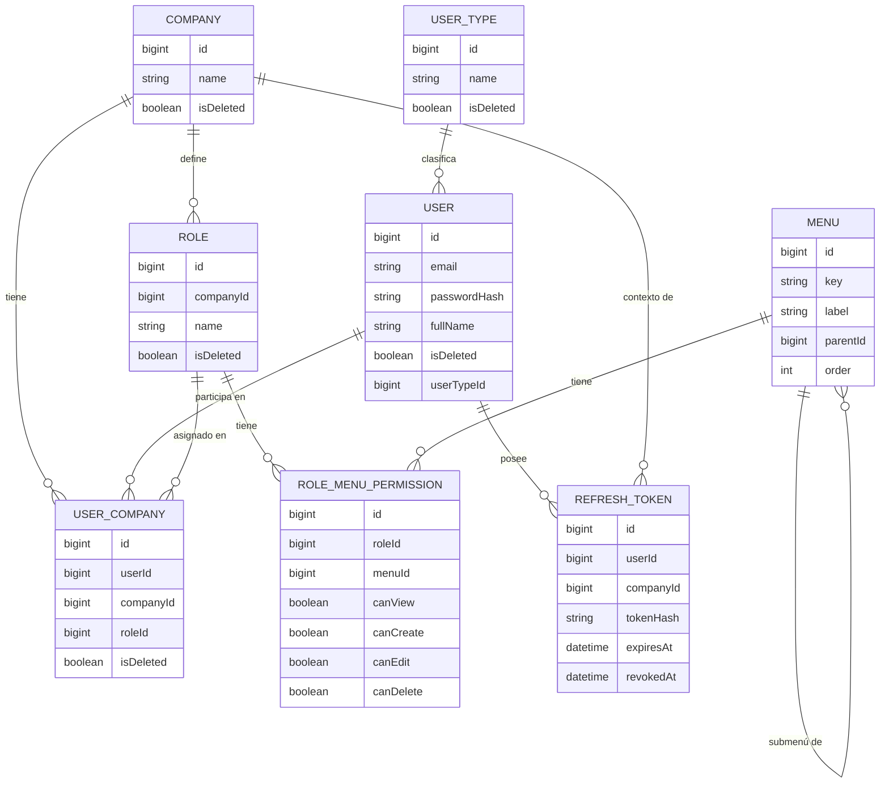

# Documentación viva — RedPecuaria Backend

Este directorio documenta el **estado actual** de cada funcionalidad de negocio y su
**historial de cambios**. Ver la regla completa en [ARCHITECTURE.md §11](../ARCHITECTURE.md).

## Cómo está organizado

Cada funcionalidad tiene su propia carpeta:

```
docs/<funcionalidad>/
  <funcionalidad>.md       # estado actual — descripción, reglas de negocio, diagrama
  changes/
    YYYY-MM-DD-slug.md     # un archivo por cambio, nunca se edita después de creado
```

- Para saber **cómo funciona algo hoy**: leer `docs/<funcionalidad>/<funcionalidad>.md`.
- Para saber **por qué es así / qué cambió y cuándo**: leer los archivos en
  `docs/<funcionalidad>/changes/`, ordenados por fecha (el nombre del archivo empieza con
  `YYYY-MM-DD`).
- Para saber **qué se implementó en el código**: ver [`CHANGELOG.md`](../CHANGELOG.md) en la
  raíz del proyecto.

## Funcionalidades documentadas

| Funcionalidad | Descripción breve |
|---|---|
| [company](./company/company.md) | Empresas del sistema multiempresa |
| [user](./user/user.md) | Identidad de una persona (sin empresa ni rol) |
| [role](./role/role.md) | Roles, creados por cada empresa |
| [user-company](./user-company/user-company.md) | Vínculo usuario ↔ empresa ↔ rol |
| [user-type](./user-type/user-type.md) | Tipo de usuario (Administrador/Inversionista) — informativo |
| [menu](./menu/menu.md) | Catálogo global de menús del sistema |
| [permission](./permission/permission.md) | Permisos de un rol sobre un menú (CRUD por menú) |
| [auth-sessions](./auth-sessions/auth-sessions.md) | Login, JWT, refresh tokens |
| [property](./property/property.md) | Propiedad (finca ganadera) — primer módulo del negocio en sí |
| [investment](./investment/investment.md) | Inversión (compra de ganado + inversionistas) y Kardex de movimientos |

## Modelo de datos completo (visión general)

El diagrama de abajo cubre el módulo `auth` (administración/plataforma). `property` e
`investment` (negocio ganadero en sí) tienen su propio diagrama, más chico, en cada uno de sus
`.md` — se conectan a este solo por `COMPANY` (`Property.companyId`) y por `USER`
(`InvestmentInvestor.userId`).



> Estado general: ✅ **Fase 1, Fase 2 y Fase 3 completas** (esquema de base de datos, datos
> semilla, y dominio + persistencia de los 7 conceptos, verificado contra datos reales).
> Pendiente desde Fase 4 (CRUD de empresas) en adelante — ver el estado de implementación en
> cada `docs/<funcionalidad>/`. El plan completo vive en la conversación con el equipo; a
> medida que se completa cada fase, este directorio se actualiza junto con `CHANGELOG.md`.
