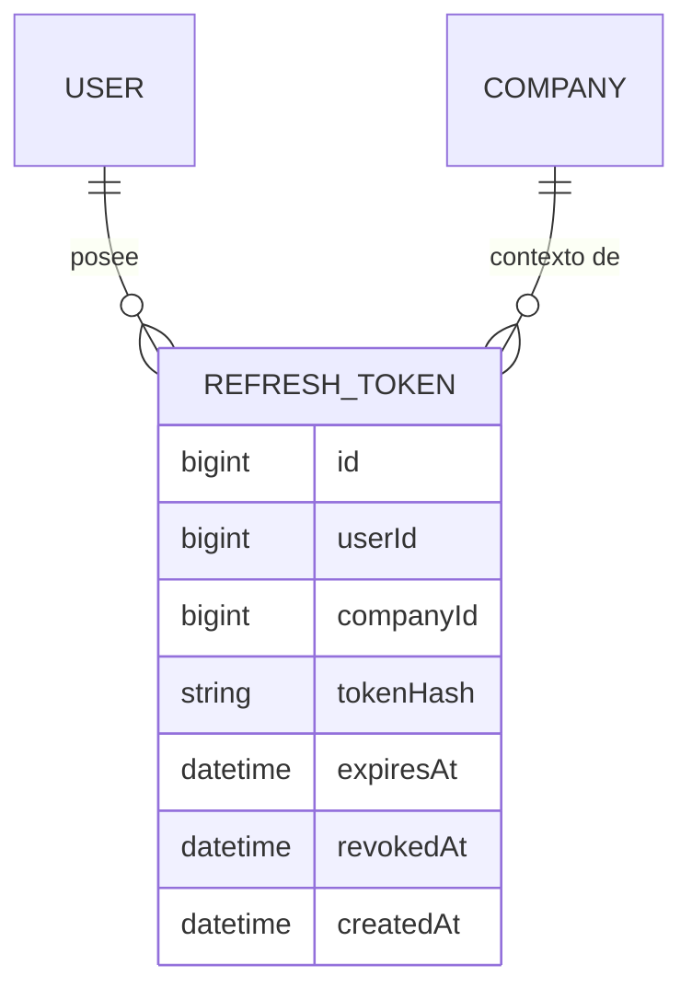

# Auth Sessions (login, JWT, refresh tokens)

**Estado de implementación:** ✅ Fase 1 (migración de `refresh_tokens`), Fase 8
(`LoginUseCase`, `RefreshTokenUseCase`, `LogoutUseCase`, `AuthSessionsController`) y Fase 9 —
guard global (`JwtAuthGuard`) completas. Pendiente: `@RequiresPermission(menuKey, action)` +
`PermissionGuard` para autorización dinámica por menú (hoy el guard solo valida identidad, no
permisos — ver `permission.md`).

## Propósito

Cómo se autentica un usuario y cómo se mantiene su sesión. Estrategia: JWT de acceso de corta
duración + refresh token opaco, persistido y revocable.

## Modelo de dominio

## Reglas de negocio actuales

- **Login es por `username` + contraseña**, no por email (desde
  [2026-09-01](../user/changes/2026-09-01-username-como-login.md)) — `username` es el
  identificador único de `User`, el email puede repetirse.
- **Access token**: corto (15 min por defecto), firmado, contiene `sub` (userId), `companyId`,
  `roleId`, `email`, `username`, `fullName`, `isSuperAdmin` e `isInvestor` (ambos booleanos, ver
  `docs/user-type/user-type.md` — mutuamente excluyentes, todo usuario tiene exactamente un
  `UserType`). No se persiste — se valida solo con la firma. `username` y `fullName` se copian
  del `User` al emitir el token (login, refresh, `switch-company`) — si el usuario cambia su
  nombre, se ve recién en su próxima emisión de token, igual criterio que `isSuperAdmin`/
  `isInvestor`.
- **Refresh token**: opaco (no es un JWT), se guarda **hasheado** (SHA-256) en
  `refresh_tokens` — nunca en texto plano. Es revocable y **rota en cada uso**: al refrescar,
  se invalida el token usado y se emite uno nuevo.
- Si se detecta el uso de un refresh token **ya revocado** (indicio de robo/reuso), se revocan
  todas las sesiones activas de ese usuario como medida de seguridad.
- **Login**: si el usuario tiene un solo `UserCompany` activo, se autentica directo contra esa
  empresa; si tiene varios, debe indicar con cuál empresa iniciar sesión (no se emiten tokens
  hasta que la empresa quede resuelta).
- No hay auto-registro: los usuarios los crea un administrador (ver `user.md`).
- La autorización de cada request no depende de un rol fijo, sino de consultar
  `role_menu_permissions` para el `roleId` + `companyId` del token (ver `permission.md`).

## Casos de uso (Application)

| Caso de uso | Qué hace | Errores que puede lanzar |
|---|---|---|
| `LoginUseCase` | Valida credenciales, resuelve la empresa activa, emite access + refresh token | `InvalidCredentialsException`, `NoActiveUserCompanyException`, `CompanySelectionRequiredException` |
| `RefreshTokenUseCase` | Rota el refresh token y emite un par nuevo; revoca todas las sesiones si detecta reuso | `InvalidRefreshTokenException`, `NoActiveUserCompanyException`, `UserNotFoundException` |
| `LogoutUseCase` | Revoca el refresh token (idempotente) | — |

## Guard global (Fase 9)

- `JwtAuthGuard` (`infrastructure/core/security/jwt-auth.guard.ts`), registrado global vía
  `APP_GUARD` en `core.module.ts` — **protege por defecto** toda ruta nueva, no hay que
  acordarse de agregarle nada. Valida el access token del header `Authorization: Bearer <token>`
  con `TokenGenerator.verifyAccessToken()` y deja el payload en `request.user`.
- `@Public()` (`infrastructure/common/http/public.decorator.ts`) — única forma de eximir una
  ruta del guard. Hoy solo la usan `login`/`refresh`/`logout` (no tienen o no necesitan un
  access token vigente).
- `@CurrentUser()` (`infrastructure/common/http/current-user.decorator.ts`) — lee el payload
  ya validado en un controlador, sin tocar `Request` de Express. Ej.:
  `@CurrentUser('roleId') roleId: string`.
- `GET /me` (`MeController`) — primer endpoint protegido del proyecto, devuelve el payload del
  token actual; existe para verificar el guard de punta a punta.
- **Lo que el guard NO hace todavía**: solo verifica *quién sos* (identidad) — no si tenés
  permiso para una acción concreta. Eso es autorización dinámica por menú
  (`@RequiresPermission(menuKey, action)` + `PermissionGuard`, consultando
  `RoleMenuPermissionRepository`), que sigue pendiente.

**Resuelto**: `CompanySelectionRequiredException.choices` (la lista de empresas entre las que
elegir) ya viaja en la respuesta HTTP, en un campo `details` que `GlobalExceptionFilter` agrega
cuando la excepción lo trae (`DomainException.details?: Record<string, unknown>`, genérico —
cualquier excepción futura puede sumar datos estructurados sin tocar el filtro). El frontend
usa `details.choices` para mostrar un selector de empresa cuando el login devuelve este error
(ver `ARCHITECTURE.md §4` del frontend).

**Pendiente/simplificación conocida**: la duración del refresh token (30 días) está
hardcodeada en los casos de uso — no se conecta todavía a `JWT_REFRESH_EXPIRES_IN_DAYS` del
`.env` (el access token sí usa `JWT_ACCESS_EXPIRES_IN_SECONDS` vía `JwtModule`, eso sí está
conectado).

## Últimos cambios

Ver el historial completo en [`changes/`](./changes/).

- [2026-09-06 — `isInvestor` en el access token, para el dashboard por tipo de usuario](../dashboard/changes/2026-09-06-dashboard-por-tipo-de-usuario.md)
- [2026-09-04 — `username`/`fullName` en el access token](./changes/2026-09-04-fullname-en-el-token.md)
- [2026-09-02 — Fase 9: guard global de autenticación](./changes/2026-09-02-fase-9-guard-global.md)
- [2026-09-01 — Login por `username`, no por email](../user/changes/2026-09-01-username-como-login.md)
- [2026-08-31 — Fase 8: login, refresh y logout](./changes/2026-08-31-fase-8-login-refresh-logout.md)
- [2026-08-23 — Corrección: ids de UUID a bigint](./changes/2026-08-23-cambio-ids-a-bigint.md)
- [2026-08-23 — Fase 1: migración inicial aplicada](./changes/2026-08-23-fase-1-migracion-inicial.md)
- [2026-08-23 — Diseño inicial](./changes/2026-08-23-diseno-inicial.md)
