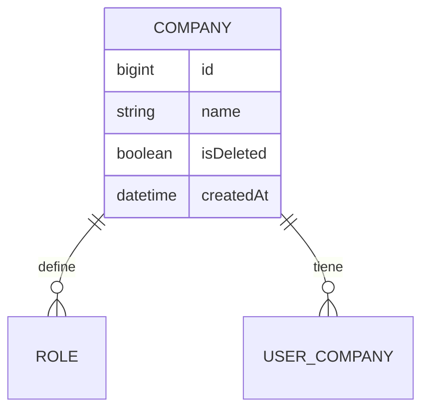

# Company (Empresa)

**Estado de implementación:** ✅ Fase 1, Fase 2 (seed: empresa "Empresa"), Fase 3 (dominio +
persistencia), Fase 4 (casos de uso) y `CompanyController` (HTTP) completas — protegido por el
guard (Fase 9), sin autorización por permiso todavía (ver `docs/permission/permission.md`).

## Propósito

Representa una empresa (tenant) del sistema multiempresa. Es la unidad organizativa a la que
se asocian roles (`Role`) y usuarios (vía `UserCompany`).

## Modelo de dominio

## Reglas de negocio actuales

- Una empresa tiene un nombre y un estado activo/inactivo (`deactivate()`, no se elimina).
- Los roles (`Role`) y los vínculos usuario-empresa (`UserCompany`) están *scoped* a una
  empresa: no existen fuera de una empresa concreta.
- La creación de empresas está, por ahora, dentro del CRUD normal (gateada por el mismo
  sistema de permisos que todo lo demás, vía el menú "Empresas"). No hay todavía una
  restricción de "super-admin de plataforma" — eso queda para un trabajo futuro fuera de
  este plan.

## Casos de uso (Application)

| Caso de uso | Qué hace | Errores que puede lanzar |
|---|---|---|
| `CreateCompanyUseCase` | Crea una empresa | — |
| `UpdateCompanyUseCase` | Renombra una empresa existente | `CompanyNotFoundException` |
| `DeactivateCompanyUseCase` | Desactiva una empresa (`isDeleted = true`) | `CompanyNotFoundException` |
| `ListCompaniesUseCase` | Lista empresas — todas las **activas**, ordenadas por `name` (`ORDER BY` en la query), si el usuario es Super Administrador (`CompanyRepository.findAllActive()`), solo la de su sesión si no (ver `docs/user-type/user-type.md`) | — |

## HTTP

| Método y ruta | Caso de uso |
|---|---|
| `POST /companies` | `CreateCompanyUseCase` |
| `PATCH /companies/:id` | `UpdateCompanyUseCase` |
| `PATCH /companies/:id/deactivate` | `DeactivateCompanyUseCase` (204) |
| `GET /companies` | `ListCompaniesUseCase` |

## Últimos cambios

Ver el historial completo en [`changes/`](./changes/).

- [2026-09-03 — `is_active` → `is_deleted` en las 7 tablas con baja lógica](./changes/2026-09-03-is-active-a-is-deleted.md)
- [2026-09-03 — CRUD de Empresas en el frontend + filtro por activas](./changes/2026-09-03-crud-frontend-y-filtro-activas.md)
- [2026-09-02 — Super Administrador y visibilidad de empresas](../user-type/changes/2026-09-02-super-administrador-y-visibilidad-de-empresas.md)
- [2026-09-02 — Controladores CRUD + CORS](./changes/2026-09-02-controladores-crud.md)
- [2026-08-31 — Fase 4: casos de uso CRUD de empresas](./changes/2026-08-31-fase-4-casos-de-uso-company.md)
- [2026-08-23 — Fase 3: dominio y persistencia](./changes/2026-08-23-fase-3-dominio-persistencia.md)
- [2026-08-23 — Fase 2: seed inicial aplicado](./changes/2026-08-23-fase-2-seed.md)
- [2026-08-23 — Corrección: ids de UUID a bigint](./changes/2026-08-23-cambio-ids-a-bigint.md)
- [2026-08-23 — Fase 1: migración inicial aplicada](./changes/2026-08-23-fase-1-migracion-inicial.md)
- [2026-08-23 — Diseño inicial](./changes/2026-08-23-diseno-inicial.md)
