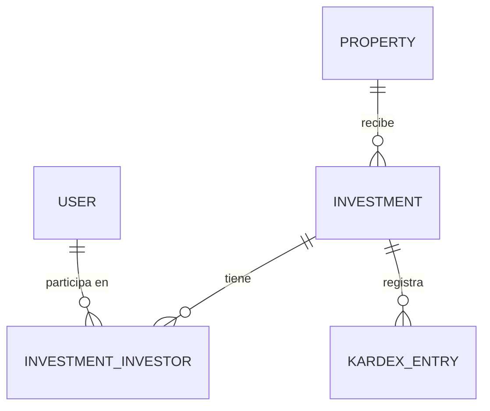

# Dashboard

**Estado de implementación:** ✅ Un dashboard distinto por tipo de usuario (Inversionista vs.
Administrador/Super Administrador), 2026-09-06.

## Propósito

La pantalla que ve cualquier usuario apenas se loguea (`/dashboard`, destino fijo del login —
ver `docs/auth-sessions/auth-sessions.md`). No es un módulo de negocio con su propio CRUD, es
un **modelo de lectura** que resume datos que ya existen en otros módulos (Propiedades,
Inversiones, Kardex, Usuarios) de una forma útil según quién está mirando.

## Por qué dos dashboards, no uno

Decidido explícitamente con el usuario: un Administrador/Super Administrador ya tiene acceso
directo a las pantallas completas (Inversiones filtradas por Gestión, Kardex de cualquier
inversión) — un resumen genérico no le suma nada que esas pantallas no den ya, mejor. Un
Inversionista, en cambio, no tenía **ningún** lugar que le mostrara de un vistazo "esto es lo
que tengo invertido, esto es mi saldo actual" — tenía que entrar a `/kardex`, elegir cada
inversión y sumar a mano. Por eso el dashboard de Inversionista muestra datos reales de sus
propias inversiones, y el de Administrador/Super Administrador muestra agregados de la empresa
activa (nunca de todas las empresas, ni para un Super Administrador — mismo criterio que el
resto de la app).

## Por qué estos números y no otros (el límite real de `KardexEntry.total`)

`docs/investment/investment.md` ya documenta que el Kardex está en "Fase 1: no calcula nada" —
`total` es un número que el usuario tipea a mano, **sin una fórmula definida** (no es "precio ×
kilos", no hay reparto de ganancias implementado). Sumar `total` de **todos** los movimientos y
llamarlo "capital invertido" habría sido inventar un significado que el negocio no definió
todavía.

El único número de dinero con significado real hoy es la suma de `total` en movimientos
**"venta"** — porque una venta ya se atribuye a un inversionista puntual
(`KardexEntry.investorUserId`, ver `docs/investment/investment.md`), así que "cuánto dinero
recibió este inversionista por sus ventas" es un cálculo que no inventa nada, solo suma datos
que ya están ahí con ese significado. Por eso:

- **No existe** ninguna tarjeta de "capital invertido", "ganancia" ni "rentabilidad".
- **Sí existe** "Total recibido en ventas" (Inversionista) / "Total en ventas" (Admin) —
  `SUM(kardexEntry.total) WHERE movementType = 'venta'`, acotado al inversionista o a la
  empresa según el dashboard.
- El resto de los números son **conteos** (propiedades, inversiones, inversionistas) o **el
  saldo actual** (última fila del kardex de cada inversión, no un cálculo — la Fase 1 tampoco
  deriva saldos corridos, solo los muestra tal cual se cargaron).

## Modelo de dominio

`DashboardRepository` no tiene una entidad de dominio propia con invariantes — es el **único
repositorio del proyecto que corta transversalmente varios agregados** (Property, Investment,
KardexEntry, User) en vez de vivir dentro de "su" módulo. Sus tipos (`InvestorDashboardSummary`,
`AdminDashboardSummary`, etc.) son interfaces planas, mismo criterio que `PaginatedResult<T>`
(`domain/common`) — no hace falta una clase con comportamiento para algo que solo agrega datos
de lectura.

## Reglas de negocio actuales

- **`isInvestor`** (nuevo campo del access token, calculado una sola vez al emitir el token —
  `UserType.isInvestor()`, igual criterio que `isSuperAdmin` — ver `docs/user-type/
  user-type.md`): decide qué dashboard arma el frontend. Mutuamente excluyente con
  `isSuperAdmin` — todo usuario tiene exactamente un `UserType`.
- Todos los agregados de Administrador/Super Administrador están acotados a la **empresa activa
  de la sesión** (`companyId` del token) — nunca a todas las empresas, ni siquiera para un Super
  Administrador (el único lugar donde sí ve todas es `GET /companies`, no acá).
- **"Últimos movimientos"** y **"Top inversionistas"** son solo del Administrador/Super
  Administrador — un Inversionista no ve movimientos ni montos de otros inversionistas, solo
  los propios.
- **Sin chequeo de `isInvestor` en el backend**: los dos endpoints (`/dashboard/investor-summary`
  y `/dashboard/admin-summary`) son alcanzables por cualquier usuario logueado — la
  autorización real es client-side (qué pantalla se muestra según el token), mismo criterio (y
  misma limitación documentada) que el resto de la app. Ver `frontend/ARCHITECTURE.md` §4.

## Casos de uso (Application)

| Caso de uso | Qué hace | Errores que puede lanzar |
|---|---|---|
| `GetInvestorDashboardUseCase` | Trae el resumen del usuario logueado como inversionista (inversiones + saldo actual de cada una + total recibido en ventas) | — |
| `GetAdminDashboardUseCase` | Trae el resumen de la empresa activa (conteos, total en ventas, top 5 inversionistas, últimos 5 movimientos) | — |

## HTTP

| Método y ruta | Caso de uso |
|---|---|
| `GET /dashboard/investor-summary` | `GetInvestorDashboardUseCase` — `userId`/`companyId` siempre de `@CurrentUser()` |
| `GET /dashboard/admin-summary` | `GetAdminDashboardUseCase` — `companyId` siempre de `@CurrentUser()` |

Sin DTO/mapper propios en el controller (a diferencia del resto de los módulos): el shape que
arma `DashboardRepositoryAdapter` ya es el que viaja por HTTP — no hay una entidad de dominio
con campos internos que proteger, es un modelo de lectura puro.

## Pantalla (frontend)

`app/(main)/dashboard` — sin `RequirePermission` (mismo criterio que antes de este cambio): es
el destino fijo del login (`use-login.ts`) y el fallback de `RequirePermission` en sí, tiene que
mostrar algo para cualquiera con sesión, sea cual sea su rol. `useIsInvestor()` (nuevo hook,
mismo patrón que `useIsSuperAdmin` — lee el token decodificado, `useState` perezoso sin efecto)
decide cuál de los dos sub-componentes renderizar:

- **Inversionista**: 2 tarjetas KPI (inversiones activas, total recibido en ventas) + tabla
  "Mis inversiones" (propiedad, gestión, descripción, saldo actual en cabezas y kilos).
- **Administrador/Super Administrador**: 4 tarjetas KPI (propiedades, inversiones,
  inversionistas, total en ventas) + "Top inversionistas" (barras de progreso, mismo estilo que
  tenía el dashboard con datos falsos) + tabla "Últimos movimientos" (fecha, propiedad/
  inversión, detalle, total).

**Iteración previa, descartada**: "Top inversionistas" y "Últimos movimientos" se probaron
lado a lado (`grid-cols-2`) — con 4 columnas, la tabla de movimientos perdía la columna "Total"
fuera de la vista (solo alcanzable haciendo scroll horizontal dentro de la mitad de ancho de la
tarjeta, sin ninguna señal de que hiciera falta scrollear). Se cambió a apiladas, ambas a ancho
completo.

**Reemplaza al dashboard anterior**, que tenía **datos 100% hardcodeados** (`mockMeses`,
`mockTopInversionistas`, `mockLotesEnAlerta`) — no llamaba a ningún endpoint. Ver el commit
anterior a este cambio para el diseño visual original (tarjetas KPI + gráfico + lista + tabla),
que se mantuvo como referencia de estilo para las tarjetas nuevas.

## Últimos cambios

Ver el historial completo en [`changes/`](./changes/).

- [2026-09-06 — Dashboard por tipo de usuario](./changes/2026-09-06-dashboard-por-tipo-de-usuario.md)
