# Investment (Inversión) + Kardex

**Estado de implementación:** ✅ CRUD completo (backend + frontend), 2026-09-04. **Fase 1
deliberadamente simple: solo carga de datos, sin ningún cálculo** — ver "Decisiones de alcance"
más abajo, es la parte más importante de este documento.

## Propósito

Una `Investment` es el negocio de compra de ganado enviado a una `Property` — uno o más
usuarios (tipo Inversionista) participan de ella. El `Kardex` es la ficha de movimientos de esa
inversión: cada entrada, baja o venta de ganado, calcada de la planilla Excel que ya usa el
negocio (ver la imagen de referencia en la conversación de diseño).

## Modelo de dominio

```mermaid
erDiagram
    PROPERTY ||--o{ INVESTMENT : "recibe"
    INVESTMENT ||--o{ INVESTMENT_INVESTOR : "tiene"
    USER ||--o{ INVESTMENT_INVESTOR : "participa en"
    INVESTMENT ||--o{ KARDEX_ENTRY : "registra"
    INVESTMENT {
        bigint id
        bigint propertyId
        int gestion
        string description
        boolean isDeleted
        datetime createdAt
    }
    INVESTMENT_INVESTOR {
        bigint id
        bigint investmentId
        bigint userId
    }
    KARDEX_ENTRY {
        bigint id
        bigint investmentId
        date entryDate
        string detail
        numeric avgWeight
        int entryQuantity
        numeric entryKilos
        int exitQuantity
        numeric exitKilos
        int balanceQuantity
        numeric balanceKilos
        numeric total
        boolean isDeleted
        datetime createdAt
    }
```

## Decisiones de alcance (Fase 1 — no calcula nada)

Definidas explícitamente con el usuario antes de implementar, para que quede registrado el
motivo de cada límite:

- **`gestion` es un número (año), no texto libre** — se muestra en un combobox en el frontend
  (rango generado en runtime: del año que viene hasta 6 para atrás, sin mantenerlo a mano).
- **Sin campo "Lote"** — la planilla de referencia usa "Lote No 10", pero se decidió no
  modelarlo como concepto propio todavía. `description` (texto libre, ej. "Torillos") es lo
  que diferencia dos inversiones de la misma propiedad.
- **El campo de dinero de cada movimiento se llama `total`, no `valor`** (columna sin nombre a
  la derecha de la planilla de referencia) — un número que el usuario tipea a mano, sin ningún
  significado calculado todavía (no es "precio × kilos" ni nada — eso es un cálculo de una
  fase futura).
- **El "modelo de negocio 45%-55%"** (reparto entre inversionista y empresa, visible en el
  encabezado de la planilla de referencia) **es fijo para toda la app** — pero todavía no se
  usa en ningún lado del sistema. No hay ninguna entidad ni configuración para esto en el
  código todavía; queda para cuando exista el cálculo de reparto de ganancias.
- **Sin cálculo de saldos corridos**: en la planilla de referencia, "Saldos" es la cantidad y
  kilos que quedan después de cada movimiento — acá también lo tipea el usuario a mano, el
  sistema no lo deriva de las filas anteriores. Mismo criterio para todos los demás campos:
  nada se calcula, todo es carga de datos.
- **Sin atribuir un movimiento de kardex a un inversionista puntual** — la planilla de
  referencia asigna cada venta a uno de los inversionistas del fondo (columna con las
  iniciales OVD/ET/JJ); acá esa columna no existe todavía. Los inversionistas están a nivel de
  `Investment` completa, no de cada movimiento.
- **Sin reparto de "bajas" (muertes) entre inversionistas** — no había una regla clara todavía
  de cómo se reparte esa pérdida, así que se registra sin ningún inversionista asociado (mismo
  punto que el anterior).

## Reglas de negocio actuales

- Una `Investment` pertenece a **una `Property`** (y por lo tanto a una empresa, a través de
  ella) — sin `companyId` propio.
- Necesita **al menos un inversionista** (`InvestorsRequiredException` si la lista viene vacía).
- Un inversionista tiene que ser: un usuario que exista, de tipo **Inversionista**
  (`UserType.isInvestor()`, ver `docs/user-type/user-type.md`), y que pertenezca (con
  `UserCompany` activo) a la empresa de la inversión — cualquier otra combinación lanza
  `InvalidInvestorException`. No hace falta que el inversionista tenga acceso a la propiedad ni
  nada más específico, solo ser un Inversionista de esa empresa.
- Los inversionistas de una inversión se **reemplazan completos** al editar (no hay "agregar
  uno" / "sacar uno" como acciones separadas) — se manda la lista completa nueva.
- Un `KardexEntry` pertenece a **una `Investment`** — se valida la cadena completa
  `KardexEntry → Investment → Property → Company` en cada operación, no solo el primer nivel.

## Casos de uso (Application)

### Investment

| Caso de uso | Qué hace | Errores que puede lanzar |
|---|---|---|
| `CreateInvestmentUseCase` | Crea la inversión y le asigna sus inversionistas, en una transacción | `PropertyNotFoundException`, `InvestorsRequiredException`, `InvalidInvestorException` |
| `UpdateInvestmentUseCase` | Actualiza gestión/descripción y reemplaza los inversionistas | `InvestmentNotFoundException`, `InvestorsRequiredException`, `InvalidInvestorException` |
| `DeactivateInvestmentUseCase` | Desactiva una inversión | `InvestmentNotFoundException` |
| `ListInvestmentsByPropertyUseCase` | Lista las inversiones activas de una propiedad, con los ids de sus inversionistas | `PropertyNotFoundException` |

### Kardex

| Caso de uso | Qué hace | Errores que puede lanzar |
|---|---|---|
| `CreateKardexEntryUseCase` | Crea una fila de kardex | `InvestmentNotFoundException` |
| `UpdateKardexEntryUseCase` | Actualiza una fila existente | `KardexEntryNotFoundException`, `InvestmentNotFoundException` |
| `DeactivateKardexEntryUseCase` | Desactiva una fila | `KardexEntryNotFoundException`, `InvestmentNotFoundException` |
| `ListKardexEntriesByInvestmentUseCase` | Lista las filas activas de una inversión, ordenadas por fecha | `InvestmentNotFoundException` |

## HTTP

`companyId` siempre implícito (`@CurrentUser('companyId')`). `propertyId`/`investmentId` sí son
explícitos — a diferencia de una empresa, una propiedad o una inversión no son "la activa de la
sesión", el usuario elige con cuál trabajar en cada pantalla (igual se valida que sean de la
empresa activa en cada caso de uso, nunca se confía en el id a ciegas).

| Método y ruta | Caso de uso |
|---|---|
| `POST /investments` | `CreateInvestmentUseCase` |
| `PATCH /investments/:id` | `UpdateInvestmentUseCase` |
| `PATCH /investments/:id/deactivate` | `DeactivateInvestmentUseCase` (204) |
| `GET /investments?propertyId=` | `ListInvestmentsByPropertyUseCase` |
| `POST /kardex-entries` | `CreateKardexEntryUseCase` |
| `PATCH /kardex-entries/:id` | `UpdateKardexEntryUseCase` |
| `PATCH /kardex-entries/:id/deactivate` | `DeactivateKardexEntryUseCase` (204) |
| `GET /kardex-entries?investmentId=` | `ListKardexEntriesByInvestmentUseCase` |

## Pantalla (frontend)

- `app/(main)/investments` — selector de "Propiedad" arriba (igual patrón que "Rol" en
  Permisos), tabla de inversiones de esa propiedad debajo. El diálogo de alta/edición tiene un
  combobox de Gestión (años), un campo de Descripción, y un checklist de Inversionistas (solo
  usuarios de tipo Inversionista de la empresa activa).
- `app/(main)/kardex` — pantalla propia del sidebar (menú `kardex`, hermano de `properties` e
  `investments` bajo "Inversiones"), con permiso propio (`canView/canCreate/canEdit/canDelete`)
  independiente del de `investments`: un rol puede tener uno sin el otro (ej. alguien que solo
  registra movimientos de kardex, sin poder dar de alta inversiones). Elige "Propiedad" e
  "Inversión" con dos combobox propios (el segundo depende del primero, igual patrón que
  "Inversiones" elige Propiedad). El botón "Ver kardex" de la tabla de Inversiones sigue
  existiendo como atajo — navega a `/kardex?propertyId=&investmentId=` para preseleccionar los
  combobox — y solo se muestra si el rol tiene `canView` sobre `kardex`. Tabla ancha (10
  columnas + acciones, con scroll horizontal propio) calcada de la planilla de referencia. El
  diálogo agrupa Cantidad/Kilos de Entrada, Salida y Saldo de a pares, igual que la planilla.
- `entryDate` viaja como `YYYY-MM-DD` (fecha pura, sin hora) en toda la cadena — el frontend
  usa `formatDateOnly` (no el `formatDate` genérico, pensado para timestamps) para mostrarla,
  evitando el bug clásico de que una fecha sin hora se interprete como medianoche UTC y se lea
  un día antes en husos horarios negativos (Bolivia es UTC-4).

## Últimos cambios

Ver el historial completo en [`changes/`](./changes/).

- [2026-09-04 — Grupo "Inversiones" en el sidebar + permiso propio de Kardex](../menu/changes/2026-09-04-grupo-inversiones-y-kardex.md)
- [2026-09-04 — Diseño e implementación inicial](./changes/2026-09-04-diseno-inicial.md)
