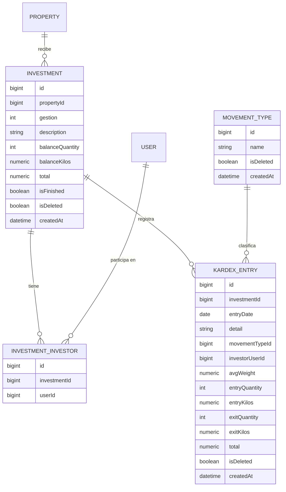

# Investment (Inversión) + Kardex

**Estado de implementación:** ✅ CRUD completo (backend + frontend), 2026-09-04. **Fase 1
deliberadamente simple: solo carga de datos, sin ningún cálculo** — ver "Decisiones de alcance"
más abajo, es la parte más importante de este documento.

## Propósito

Una `Investment` es el negocio de compra de ganado enviado a una `Property` — uno o más
usuarios (tipo Inversionista) participan de ella. El `Kardex` es la ficha de movimientos de esa
inversión: cada entrada, baja o venta de ganado, calcada de la planilla Excel que ya usa el
negocio (ver la imagen de referencia en la conversación de diseño).

## Modelo de dominio

## Decisiones de alcance (Fase 1 — no calcula nada)

Definidas explícitamente con el usuario antes de implementar, para que quede registrado el
motivo de cada límite:

- **`gestion` es un número (año), no texto libre** — se muestra en un combobox en el frontend
  (rango generado en runtime: del año que viene hasta 6 para atrás, sin mantenerlo a mano).
- **Sin campo "Lote"** — la planilla de referencia usa "Lote No 10", pero se decidió no
  modelarlo como concepto propio todavía. `description` (texto libre, ej. "Torillos") es lo
  que diferencia dos inversiones de la misma propiedad.
- **El campo de dinero de cada movimiento se llama `total`, no `valor`** (columna sin nombre a
  la derecha de la planilla de referencia) — un número que el usuario tipea a mano, sin ningún
  significado calculado todavía (no es "precio × kilos" ni nada — eso es un cálculo de una
  fase futura).
- **El "modelo de negocio 45%-55%"** (reparto entre inversionista y empresa, visible en el
  encabezado de la planilla de referencia) **es fijo para toda la app** — pero todavía no se
  usa en ningún lado del sistema. No hay ninguna entidad ni configuración para esto en el
  código todavía; queda para cuando exista el cálculo de reparto de ganancias.
- ~~Sin cálculo de saldos corridos~~ — **revisado el 2026-09-08**: el saldo (`balanceQuantity`/
  `balanceKilos`) y `total` ahora sí se calculan, pero no por fila de kardex — viven en
  `Investment` como el saldo VIGENTE, mantenido transaccionalmente en cada alta/edición/baja de
  un `KardexEntry` (ver "Reglas de negocio actuales" y `changes/2026-09-08-saldo-en-inversion-
  no-en-kardex.md`). `kardex_entries` queda como log puro de movimientos.
- **Sin atribuir un movimiento de kardex a un inversionista puntual** — la planilla de
  referencia asigna cada venta a uno de los inversionistas del fondo (columna con las
  iniciales OVD/ET/JJ); acá esa columna no existe todavía. Los inversionistas están a nivel de
  `Investment` completa, no de cada movimiento.
- **Sin reparto de "bajas" (muertes) entre inversionistas** — no había una regla clara todavía
  de cómo se reparte esa pérdida, así que se registra sin ningún inversionista asociado (mismo
  punto que el anterior).

## Reglas de negocio actuales

- Una `Investment` pertenece a **una `Property`** (y por lo tanto a una empresa, a través de
  ella) — sin `companyId` propio. La propiedad **sí se puede cambiar** al editar
  (`UpdateInvestmentUseCase` valida que la nueva propiedad sea de la empresa activa, mismo
  chequeo que al crear — `PropertyNotFoundException` si no).
- **`isFinished`** (desde 2026-09-08): estado de negocio (Activa/Terminada), **elegido a mano por
  el usuario** desde el diálogo de edición — nada lo calcula ni lo fuerza automáticamente. La
  idea de uso es marcar una inversión como Terminada cuando `balanceQuantity` llega a 0 (se
  vendió todo el stock del ingreso), pero el sistema no valida ni exige eso — es solo una
  etiqueta informativa. Distinto de `isDeleted`: una inversión terminada sigue **totalmente
  visible y operable** (se le puede seguir registrando kardex, editarla, etc.), a diferencia de
  una desactivada. Arranca siempre en `false` al crear — no es un campo de alta, solo de edición.
- Necesita **al menos un inversionista** (`InvestorsRequiredException` si la lista viene vacía).
- Un inversionista tiene que ser: un usuario que exista, de tipo **Inversionista**
  (`UserType.isInvestor()`, ver `docs/user-type/user-type.md`), y que pertenezca (con
  `UserCompany` activo) a la empresa de la inversión — cualquier otra combinación lanza
  `InvalidInvestorException`. No hace falta que el inversionista tenga acceso a la propiedad ni
  nada más específico, solo ser un Inversionista de esa empresa.
- Los inversionistas de una inversión se **reemplazan completos** al editar (no hay "agregar
  uno" / "sacar uno" como acciones separadas) — se manda la lista completa nueva.
- Un `KardexEntry` pertenece a **una `Investment`** — se valida la cadena completa
  `KardexEntry → Investment → Property → Company` en cada operación, no solo el primer nivel.
- Cada `KardexEntry` tiene un `movementTypeId` — FK a `kardex_movement_types` (catálogo cerrado,
  sembrado por migración, sin CRUD propio, solo `GET /kardex-movement-types` para listar; mismo
  criterio que `UserType`/`user_types`, ver `domain/kardex/entities/movement-type.ts`). Tres
  filas fijas: **"ingreso"** (carga general de ganado a la inversión) y **"baja"**
  (pérdida/muerte) son generales, sin inversionista particular; **"venta"** se atribuye a un
  inversionista puntual (a quién se le reparte esa venta). `investorUserId` es obligatorio y
  validado contra la lista de inversionistas de la inversión
  (`InvestmentRepository.findInvestorIds`) si el tipo de movimiento es "venta"
  (`MovementType.isVenta()`); en cualquier otro caso debe venir vacío — cualquier combinación
  inválida lanza `InvalidKardexInvestorException` (ver `assertKardexInvestor`, que recibe el
  `MovementType` ya resuelto, no un id ni un string).
- **Saldo vigente en `Investment`, no en `kardex_entries`** (desde 2026-09-08): cada tipo de
  movimiento carga campos distintos y afecta el saldo distinto —
  **Ingreso** (`entryQuantity`+`entryKilos`+`total`, dato manual) suma cantidad, kilos y total;
  **Baja** (`exitQuantity` solamente) resta cantidad, **no toca kilos** (no pide kilos como
  input); **Venta** (`exitQuantity`+`exitKilos`+`total`, dato manual) resta cantidad y kilos, y
  suma su `total`. La traducción movimiento → delta vive en `computeMovementDelta`
  (`application/kardex`); quién aplica el delta y nunca deja `balanceQuantity`/`balanceKilos`
  negativo es `Investment.applyBalanceDelta` (`InsufficientInvestmentBalanceException` si no
  alcanza). **La primera transacción activa de una inversión siempre tiene que ser "ingreso"**
  (`FirstKardexEntryMustBeIngresoException` si no) — no puede haber una Baja o Venta sin stock
  previo. Editar o desactivar un `KardexEntry` revierte/recalcula el efecto sobre el saldo en la
  misma transacción (delta neto al editar, delta invertido al desactivar).
- **Saldo corrido por fila en el listado** (desde 2026-09-08, `GET /kardex-entries`): además del
  saldo VIGENTE de la inversión, cada fila del listado trae `runningBalanceQuantity`/
  `runningBalanceKilos` — el histórico "cuánto quedaba después de este movimiento puntual",
  calculado al leer con una función de ventana SQL (`SUM(...) OVER (ORDER BY entry_date,
  created_at)`) sobre todo el historial activo de la inversión, nunca guardado (mismo criterio
  que el Dashboard: no duplicar un dato derivable). Se pagina en memoria, no con `LIMIT`/`OFFSET`
  de SQL — TypeORM envuelve cualquier `skip`/`take` combinado con un `JOIN` en una subconsulta que
  resuelve la página ANTES de calcular la función de ventana, así que cada página vería el
  acumulado solo de sus propias filas en vez del historial completo (bug real, encontrado y
  corregido en la verificación de este cambio). El historial de una inversión puntual es acotado
  en la práctica, así que traerlo completo y paginarlo en memoria es un compromiso aceptable.
- **Un Inversionista no ve las ventas de otros inversionistas de la misma inversión** —
  `GET /kardex-entries` filtra los movimientos "venta" a los que le corresponden al usuario
  logueado cuando es de tipo Inversionista (`isInvestor` del token, ver `docs/user-type/
  user-type.md`); "ingreso"/"baja" nunca se filtran (son generales, sin inversionista). Un
  Administrador/Super Administrador ve todas las ventas, sin este filtro. Es una regla de
  privacidad (cuánto le vendieron a otro inversionista es un dato que no le corresponde ver),
  aplicada en el backend (la query), no solo ocultada en el frontend — un chequeo solo en el
  cliente no evita ver el dato real inspeccionando la respuesta de la API directamente.

## Casos de uso (Application)

### Investment

| Caso de uso | Qué hace | Errores que puede lanzar |
|---|---|---|
| `CreateInvestmentUseCase` | Crea la inversión y le asigna sus inversionistas, en una transacción | `PropertyNotFoundException`, `InvestorsRequiredException`, `InvalidInvestorException` |
| `UpdateInvestmentUseCase` | Actualiza gestión/descripción y reemplaza los inversionistas | `InvestmentNotFoundException`, `InvestorsRequiredException`, `InvalidInvestorException` |
| `DeactivateInvestmentUseCase` | Desactiva una inversión | `InvestmentNotFoundException` |
| `ListInvestmentsByPropertyUseCase` | Lista las inversiones activas de una propiedad, con los ids de sus inversionistas (sin paginar) | `PropertyNotFoundException` |
| `ListInvestmentsByPropertyPaginatedUseCase` | Igual, pero paginado y con `gestion`/`investorUserId` como filtros opcionales — "Propiedad" como único filtro elegido en la pantalla de Inversiones | — |
| `ListInvestmentsByInvestorUseCase` | "Mis inversiones": las de un usuario como inversionista (`userId` siempre de la sesión), de cualquier propiedad, con los ids de sus inversionistas | — |
| `ListInvestmentsByGestionUseCase` | Las de una gestión puntual, de cualquier propiedad de la empresa, con los ids de sus inversionistas | — |
| `ListInvestmentsByInvestorUseCase` | (reusado) Las de un inversionista puntual — elegido por parámetro en `by-investor`, siempre de la sesión en `mine` | — |

### Kardex

| Caso de uso | Qué hace | Errores que puede lanzar |
|---|---|---|
| `CreateKardexEntryUseCase` | Crea una fila de kardex y aplica su delta al saldo de la inversión, en una transacción | `InvestmentNotFoundException`, `MovementTypeNotFoundException`, `FirstKardexEntryMustBeIngresoException`, `InsufficientInvestmentBalanceException`, `InvalidKardexInvestorException` |
| `UpdateKardexEntryUseCase` | Actualiza una fila existente y aplica el delta neto (nuevo − viejo) al saldo, en una transacción | `KardexEntryNotFoundException`, `InvestmentNotFoundException`, `MovementTypeNotFoundException`, `InsufficientInvestmentBalanceException`, `InvalidKardexInvestorException` |
| `DeactivateKardexEntryUseCase` | Desactiva una fila y revierte su efecto sobre el saldo, en una transacción | `KardexEntryNotFoundException`, `InvestmentNotFoundException`, `MovementTypeNotFoundException`, `InsufficientInvestmentBalanceException` |
| `ListKardexEntriesByInvestmentUseCase` | Lista las filas activas de una inversión, ordenadas por fecha, con el saldo corrido (cantidad/kilos) después de cada una — si quien pide el listado es Inversionista, filtra las "venta" de otros inversionistas | `InvestmentNotFoundException` |
| `ListMovementTypesUseCase` | Lista el catálogo de tipos de movimiento (`ingreso`/`venta`/`baja`) | — |

## HTTP

`companyId` siempre implícito (`@CurrentUser('companyId')`). `propertyId`/`investmentId` sí son
explícitos — a diferencia de una empresa, una propiedad o una inversión no son "la activa de la
sesión", el usuario elige con cuál trabajar en cada pantalla (igual se valida que sean de la
empresa activa en cada caso de uso, nunca se confía en el id a ciegas).

| Método y ruta | Caso de uso |
|---|---|
| `POST /investments` | `CreateInvestmentUseCase` |
| `PATCH /investments/:id` | `UpdateInvestmentUseCase` |
| `PATCH /investments/:id/deactivate` | `DeactivateInvestmentUseCase` (204) |
| `GET /investments?propertyId=` | `ListInvestmentsByPropertyUseCase` — usado por el atajo "Ver kardex" de la tabla de Inversiones, sin paginar, no por la tabla en sí (ver más abajo) |
| `GET /investments/by-property?propertyId=&page=&pageSize=&gestion=&investorUserId=&search=` | `ListInvestmentsByPropertyPaginatedUseCase` — "Propiedad" como único filtro elegido en la pantalla de Inversiones, paginado en el servidor |
| `GET /investments/by-gestion?gestion=&page=&pageSize=&propertyId=&investorUserId=&search=` | `ListInvestmentsByGestionUseCase` — paginado en el servidor |
| `GET /investments/by-investor?investorUserId=&page=&pageSize=&propertyId=&search=` | `ListInvestmentsByInvestorUseCase` — `investorUserId` explícito (búsqueda de un administrador, no "mis inversiones"), paginado en el servidor |
| `GET /investments/mine?page=&pageSize=` | `ListInvestmentsByInvestorUseCase` — `userId` sale de `@CurrentUser('sub')`, nunca de un parámetro; paginado en el servidor |
| `POST /kardex-entries` | `CreateKardexEntryUseCase` |
| `PATCH /kardex-entries/:id` | `UpdateKardexEntryUseCase` |
| `PATCH /kardex-entries/:id/deactivate` | `DeactivateKardexEntryUseCase` (204) |
| `GET /kardex-entries?investmentId=&page=&pageSize=&search=` | `ListKardexEntriesByInvestmentUseCase` — paginado en el servidor, `search` filtra por `detail`; si el que llama es Inversionista (`isInvestor` del token), filtra las "venta" de otros inversionistas |
| `GET /kardex-movement-types` | `ListMovementTypesUseCase` — catálogo cerrado (`ingreso`/`venta`/`baja`), sin paginar |

`page`/`pageSize`/`search` son el mismo patrón que `GET /users` (ver `docs/auth-sessions` o
`ARCHITECTURE.md` §8/§9 del backend): `PaginationParams`/`PaginatedResult<T>` en el dominio,
`PaginatedResponseDto<T>` levantado a `{data, meta}` por el `ResponseInterceptor`. `propertyId`
e `investorUserId` en `by-gestion`/`by-investor` son filtros de servidor opcionales, no
`.filter()` del cliente — con paginación real, filtrar solo la página ya traída daría
resultados incompletos.

## Pantalla (frontend)

- `app/(main)/investments` — tres filtros, ninguno con una opción "Todos"/"Todas" (regla
  general del proyecto, ver `frontend/ARCHITECTURE.md` §10), **y los tres disparan la consulta
  de forma independiente** (`GET /investments/by-gestion?gestion=`, `.../by-investor?
  investorUserId=` o `.../by-property?propertyId=` — cualquiera de los tres alcanza por sí
  solo): sin ninguno de los tres elegido, la tabla ni se pide. Con prioridad Gestión >
  Inversionista > Propiedad cuando hay más de uno elegido a la vez — el (o los) que no dispara
  la consulta viaja como parámetro extra de esa misma consulta de servidor (sirve para
  "inversiones de tal inversionista en tal gestión", por ejemplo), nunca como filtro de cliente
  sobre la página ya traída. Los tres combos tienen un botón "×" para volver a "sin elegir" y
  dejar de aplicar ese filtro (ver `Select`/`onClear`, `frontend/ARCHITECTURE.md` §9) — antes de
  esto no había forma de deshacer una elección, y "Propiedad" sola no disparaba nada. Los tres
  filtros están paginados en el servidor (`page`/`pageSize`, `<Pagination>`) — cambiar
  cualquiera de los tres resetea la página a 1. "Nueva inversión" es siempre visible (con
  permiso `canCreate`), sin importar ningún filtro elegido — el diálogo (alta y edición) tiene
  su propio combobox de Propiedad (además de Gestión y el checklist de Inversionistas),
  **editable en los dos modos**: en el alta se precarga con la Propiedad del filtro de la página
  si ya había una elegida (sigue siendo editable); al editar, se puede cambiar a cualquier otra
  propiedad de la empresa activa — mueve la inversión de propiedad de verdad.
- `app/(main)/kardex` — pantalla propia del sidebar (menú `kardex`, hermano de `properties` e
  `investments` bajo "Inversiones"), con permiso propio (`canView/canCreate/canEdit/canDelete`)
  independiente del de `investments`: un rol puede tener uno sin el otro (ej. alguien que solo
  registra movimientos de kardex, sin poder dar de alta inversiones). **"Mis inversiones"**: sin
  ninguna elegida, se muestra una lista clickeable (no un combobox) de las inversiones donde el
  usuario logueado es inversionista (`GET /investments/mine`, sin filtro de propiedad) — clic en
  una fila entra a su kardex. El botón "Ver kardex" de la tabla de Inversiones (para quien no es
  inversionista, ej. un Administrador armando el kardex de cualquier inversión de la empresa)
  sigue existiendo como atajo — navega a `/kardex?propertyId=&investmentId=` para resolver esa
  inversión puntual sin pasar por "mis inversiones" — y solo se muestra si el rol tiene
  `canView` sobre `kardex`. Tabla ancha (10 columnas + acciones, con scroll horizontal propio)
  calcada de la planilla de referencia. El diálogo agrupa Cantidad/Kilos de Entrada, Salida y
  Saldo de a pares, igual que la planilla. Dos paginaciones de servidor independientes en la
  misma pantalla, cada una con su propio estado de página: "Mis inversiones"
  (`GET /investments/mine?page=&pageSize=`) y, una vez elegida una inversión, sus movimientos
  de kardex (`GET /kardex-entries?investmentId=&page=&pageSize=&search=`, con buscador
  server-side por `detail` — antes un `.filter()` en el cliente sobre la lista completa).
- `entryDate` viaja como `YYYY-MM-DD` (fecha pura, sin hora) en toda la cadena — el frontend
  usa `formatDateOnly` (no el `formatDate` genérico, pensado para timestamps) para mostrarla,
  evitando el bug clásico de que una fecha sin hora se interprete como medianoche UTC y se lea
  un día antes en husos horarios negativos (Bolivia es UTC-4).

## Últimos cambios

Ver el historial completo en [`changes/`](./changes/).

- [2026-09-08 — Estado Activa/Terminada en Investment, elegido a mano por el usuario](./changes/2026-09-08-estado-activa-terminada.md)
- [2026-09-08 — Saldo corrido por fila en el listado de Kardex, calculado con una función de ventana SQL](./changes/2026-09-08-saldo-corrido-en-listado-kardex.md)
- [2026-09-08 — `movement_type` pasa a ser una tabla propia (`kardex_movement_types`), no un string](./changes/2026-09-08-tabla-de-tipos-de-movimiento.md)
- [2026-09-08 — El saldo (cantidad/kilos/total) vive en Investment, no en cada fila de Kardex](./changes/2026-09-08-saldo-en-inversion-no-en-kardex.md)
- [2026-09-06 — Un inversionista no ve las ventas de otros inversionistas](./changes/2026-09-06-privacidad-ventas-por-inversionista.md)
- [2026-09-06 — La propiedad de una inversión se puede cambiar al editar](./changes/2026-09-06-editar-propiedad-de-inversion.md)
- [2026-09-06 — "Nueva inversión" ya no depende de ningún filtro elegido](./changes/2026-09-06-crear-inversion-sin-filtro.md)
- [2026-09-06 — "Propiedad" también dispara la consulta, y los 3 filtros se pueden limpiar](./changes/2026-09-06-propiedad-como-filtro-independiente.md)
- [2026-09-05 — Paginación de servidor en Inversiones (3 variantes) y Kardex](./changes/2026-09-05-paginacion-de-servidor.md)
- [2026-09-04 — El atajo "Ver kardex" no te "saca" de Inversiones](./changes/2026-09-04-sidebar-y-volver-en-atajo-de-kardex.md)
- [2026-09-04 — Filtro de Gestión en la pantalla de Inversiones](./changes/2026-09-04-filtro-de-gestion-en-inversiones.md)
- [2026-09-04 — "Mis inversiones" reemplaza el selector de Propiedad en Kardex](./changes/2026-09-04-mis-inversiones-en-kardex.md)
- [2026-09-04 — Tipo de movimiento e inversionista en Kardex](./changes/2026-09-04-tipo-de-movimiento-e-inversionista-en-kardex.md)
- [2026-09-04 — Grupo "Inversiones" en el sidebar + permiso propio de Kardex](../menu/changes/2026-09-04-grupo-inversiones-y-kardex.md)
- [2026-09-04 — Diseño e implementación inicial](./changes/2026-09-04-diseno-inicial.md)
