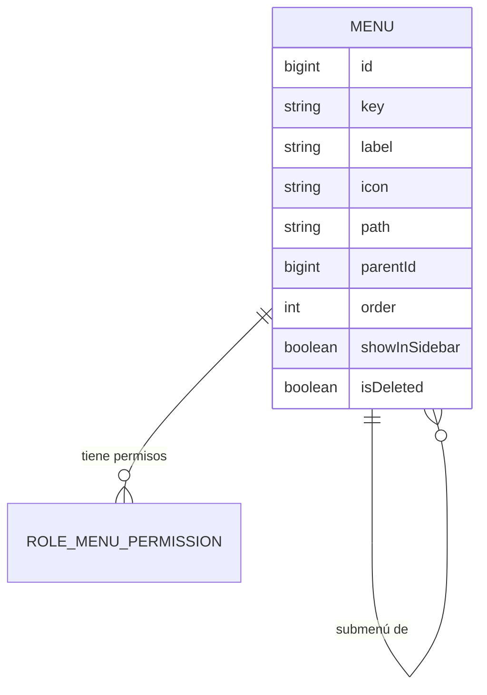

# Menu (catálogo de menús)

**Estado de implementación:** ✅ Fase 1, Fase 2 (seed), Fase 3 (dominio + persistencia),
`ListActiveMenusUseCase` y Fase 7 — `GetAuthorizedMenuUseCase` + `GET /me/menu` (protegido por
el guard de la Fase 9) completas.

## Propósito

Catálogo **global** de pantallas/funcionalidades del sistema (ej. "Empresas", "Usuarios",
"Roles", "Permisos"). Es el mismo para todas las empresas — representa qué pantallas existen
en la aplicación, no algo que cada empresa inventa.

## Modelo de dominio

## Reglas de negocio actuales

- Los menús se crean **únicamente por migración/seed** — no hay (por ahora) un endpoint de
  creación vía API. Agregar un menú nuevo es un cambio de código (una nueva pantalla real de
  la app), no un dato administrable por un usuario de negocio.
- Soporta jerarquía (`parent_id`) para submenús.
- Cada menú tiene una `key` estable (única, `UNIQUE(key)`) usada por el sistema de permisos
  (`@RequiresPermission(menuKey, action)`, ver `auth-sessions`) y por el frontend para armar
  rutas — no cambia aunque cambie el `label` visible.
- Un menú **padre puramente organizativo** (ej. "Administración") no necesita su propia fila
  en `role_menu_permissions`: el frontend lo muestra automáticamente si el usuario puede ver
  al menos uno de sus hijos. No tiene `path` propio (no es una pantalla). **Por diseño, esta
  inferencia la hace el frontend, no el backend**: `GET /me/menu` devuelve el catálogo
  **completo** (activos), cada uno con los permisos del rol (o todo en `false` si no hay fila
  configurada) — no filtra ni arma el árbol, porque el frontend necesita ver también los
  padres sin permiso explícito para poder mostrarlos cuando corresponda.
- Catálogo inicial (seed): "Administración" (padre) → "Empresas", "Usuarios", "Roles",
  "Permisos" (hijos). Se irán agregando más menús de nivel superior a medida que se
  construyan módulos nuevos (no se reservan de antemano). Segundo grupo agregado:
  "Inversiones" (padre, `key: investment-management`) → "Propiedades", "Inversiones" (hijos) —
  ver `docs/investment/investment.md`.
- `show_in_sidebar` (default `true`, migración `AddInvestmentGroupAndKardexMenu`): permite un
  menú que existe **solo como permiso**, sin ser un ítem de navegación — se usó brevemente para
  `kardex` (`false`, colgado de `investments`) hasta que el usuario pidió que Kardex fuera una
  pantalla real y accesible por sí sola (migración `MakeKardexOwnSidebarEntry`: ahora
  `show_in_sidebar: true`, `path: /kardex`, hermano de `properties`/`investments` bajo
  "Inversiones") — motivo: un rol que solo puede hacer kardex, sin acceso al CRUD de
  Inversiones, necesita una forma de **llegar** a la pantalla sin depender de un botón dentro de
  una pantalla que no puede ver. El flag queda documentado por si un caso futuro sí necesita un
  menú puramente de permiso: el árbol del frontend (`get-menu.use-case.impl.ts`) lo excluiría
  antes de construir el árbol, sin contar como "hijo" a los efectos de decidir si su padre se
  muestra como link directo o como carpeta colapsable (ver nota de diseño en
  `AddInvestmentGroupAndKardexMenu`).
- "Dashboard" (migración `AddDashboardMenu`, `order: 0`, raíz): la página de aterrizaje
  general, con `can_view` concedido a **todos los roles existentes al momento de la
  migración** — no es un recurso administrativo, cualquier rol debería poder verla. **Pendiente**:
  los roles que se creen de acá en más no reciben este permiso automáticamente — hay que
  concedérselo a mano hasta que exista un mecanismo de "permisos por defecto" para menús no
  administrativos (ver `docs/permission/permission.md`).

## Casos de uso (Application)

| Caso de uso | Qué hace | Errores que puede lanzar |
|---|---|---|
| `ListActiveMenusUseCase` | Lista el catálogo activo (para armar el árbol de navegación) | — |
| `GetAuthorizedMenuUseCase` | Catálogo activo + los permisos del rol sobre cada menú (`null`/`false` si no hay fila) | `RoleNotFoundException` |

## HTTP

- `GET /me/menu` (`MeController`) — protegido (pasa por `JwtAuthGuard`), el `roleId` sale del
  token del usuario autenticado (`@CurrentUser('roleId')`), nunca de un parámetro del cliente.
  Devuelve `MenuResponseDto[]`: cada menú activo con `canView`/`canCreate`/`canEdit`/`canDelete`
  para ese rol.

## Últimos cambios

Ver el historial completo en [`changes/`](./changes/).

- [2026-09-04 — Kardex pasa a ser pantalla propia del sidebar](./changes/2026-09-04-kardex-pantalla-propia.md)
- [2026-09-04 — Grupo "Inversiones" + permiso propio de Kardex](./changes/2026-09-04-grupo-inversiones-y-kardex.md)
- [2026-09-02 — Fase 7: `GET /me/menu`](./changes/2026-09-02-fase-7-get-me-menu.md)
- [2026-08-31 — Caso de uso de solo lectura](./changes/2026-08-31-list-active-menus-use-case.md)
- [2026-08-23 — Fase 3: dominio y persistencia](./changes/2026-08-23-fase-3-dominio-persistencia.md)
- [2026-08-23 — Fase 2: seed inicial aplicado](./changes/2026-08-23-fase-2-seed.md)
- [2026-08-23 — Corrección: ids de UUID a bigint](./changes/2026-08-23-cambio-ids-a-bigint.md)
- [2026-08-23 — Fase 1: migración inicial aplicada](./changes/2026-08-23-fase-1-migracion-inicial.md)
- [2026-08-23 — Diseño inicial](./changes/2026-08-23-diseno-inicial.md)
