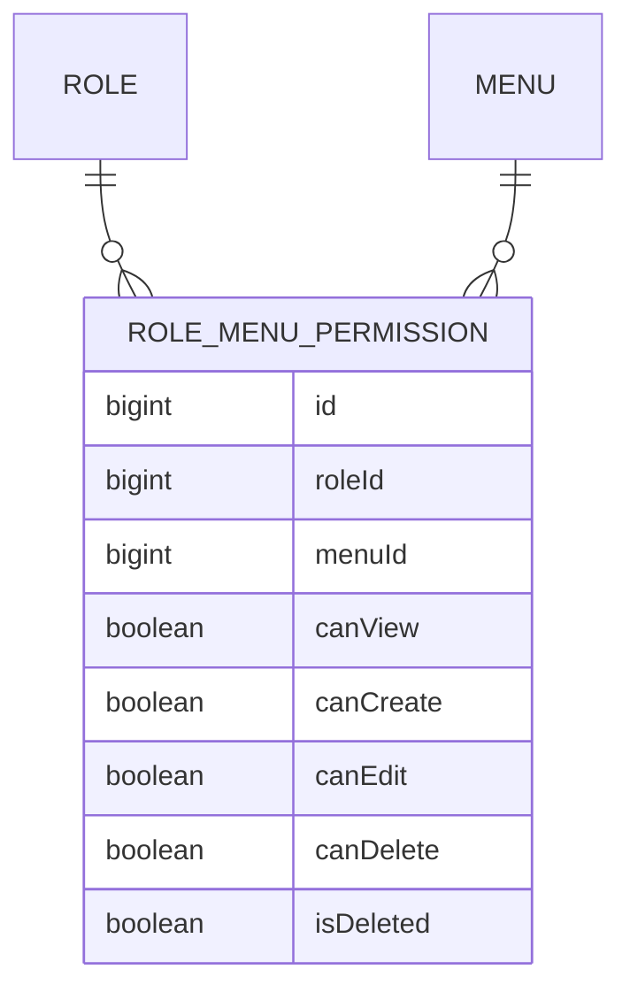

# RoleMenuPermission (permisos por menú)

**Estado de implementación:** ✅ Fase 1, Fase 2 (seed: permisos completos del rol
"Administrador"), Fase 3 (dominio + persistencia), Fase 7 (casos de uso) y
`PermissionController` (HTTP) completas — protegido por el guard de identidad (Fase 9); la
autorización dinámica por permiso (que usaría estos mismos datos para proteger otras rutas)
sigue pendiente, ver más abajo.

## Propósito

Define qué puede hacer un rol sobre un menú concreto: ver, crear, editar, eliminar. Es la base
de la **autorización dinámica** del sistema.

## Modelo de dominio

## Reglas de negocio actuales

- Único por `(role_id, menu_id)` — un rol tiene a lo sumo un registro de permisos por menú.
- **No tiene columna `company_id` propia**: como el rol ya pertenece a una empresa, el permiso
  queda *scoped* a esa empresa a través del rol (`role_id → roles.company_id`).
- Configurable en base de datos (no fijo en código): un admin de una empresa puede ajustar qué
  puede ver/hacer cada rol suyo sobre cada menú, sin tocar código ni redeploy.
- Se administra vía un CRUD dedicado ("asignar permisos a un rol").
- Reemplaza al enfoque de `@Roles()` con roles fijos: como los roles son dinámicos por
  empresa, la autorización se resuelve consultando este permiso (rol + menú + acción), no el
  nombre del rol.

## Casos de uso (Application)

| Caso de uso | Qué hace | Errores que puede lanzar |
|---|---|---|
| `SetRoleMenuPermissionUseCase` | Crea o actualiza (upsert) el permiso de un rol sobre un menú — valida que el rol pertenezca a la empresa activa | `RoleNotFoundException`, `MenuNotFoundException` |
| `ListPermissionsByRoleUseCase` | Lista los permisos ya configurados de un rol (no el catálogo completo) — misma validación de empresa | `RoleNotFoundException` |
| `ListActiveMenusUseCase` | Catálogo plano de menús activos, sin permisos de nadie (alimenta la grilla) | — |

`companyId` en `SetRoleMenuPermissionUseCase`/`ListPermissionsByRoleUseCase` sale de
`@CurrentUser('companyId')` — si el rol no pertenece a esa empresa, tiran `RoleNotFoundException`
(mismo código que "no existe": no hay que confirmarle a quien pregunta que el rol sí existe en
otra empresa). Antes no se validaba nada — cualquiera con sesión podía leer o pisar los permisos
de un rol ajeno adivinando su id. Mismo hueco y misma corrección que
`UpdateRoleUseCase`/`DeactivateRoleUseCase` (ver `docs/role/role.md`).

## HTTP

| Método y ruta | Caso de uso |
|---|---|
| `PUT /roles/:roleId/menus/:menuId/permissions` | `SetRoleMenuPermissionUseCase` (upsert) |
| `GET /roles/:roleId/permissions` | `ListPermissionsByRoleUseCase` |
| `GET /menus` | `ListActiveMenusUseCase` — catálogo plano (`MenuCatalogResponseDto`, sin `can*`), nuevo, para que la pantalla sepa qué menús existen sin depender de `GET /me/menu` (que solo trae el rol de quien pregunta) |

## Pantalla (frontend)

`app/(main)/permissions` — no es un CRUD de lista+diálogo como Empresas/Usuarios/Roles: es un
selector de "Rol" + una grilla (`PermissionMatrix`) con una fila por menú "real" (`path` no
nulo — un padre puramente organizativo como "Administración" no tiene caso de uso de negocio
detrás de sus permisos, así que no aparece) y una casilla por acción. Cada casilla guarda al
tocarla (`PUT`, con actualización optimista del lado del cliente — revierte sola si falla), no
hay un botón "Guardar" aparte. Gateado por `usePermission('permissions')`: `canView` (vía
`RequirePermission`) para la pantalla entera, `canEdit` para que las casillas sean tocables.

## Decisión: los permisos hoy solo se controlan en el frontend

El frontend (`RedPecuaria/frontend`) ya consume `GET /me/menu` para ocultar/mostrar botones y
pantallas según `canView/canCreate/canEdit/canDelete` del rol (`usePermission(menuKey)`,
`RequirePermission` para bloquear una pantalla completa por URL directa), con una única
excepción: un usuario **Super Administrador** ve/puede todo, sin importar lo que digan las filas
de `role_menu_permissions` (`applySuperAdminOverride`, aplicado en el cliente).

**Decisión explícita (2026-09-03)**: por ahora esto se implementó *solo* en el frontend, sin el
`PermissionGuard` del backend descripto abajo. Es una decisión consciente de alcance, no un
olvido — **no es control de acceso real**: cualquiera con un token válido puede seguir llamando
la API directamente (`POST/PATCH /companies`, `/roles`, etc.) sin pasar por la pantalla, sin
importar lo que el frontend oculte. Ya se demostró en vivo (ver
[`company.md`](../company/company.md)) que un usuario no-admin puede crear/editar/eliminar
empresas por API aunque el botón no aparezca en su pantalla. Implementar el guard de abajo sigue
siendo necesario antes de exponer esto fuera de un entorno de desarrollo controlado.

## Pendiente: autorización dinámica por permiso (guard de acción)

Hoy `JwtAuthGuard` (ver `auth-sessions.md`) solo valida **identidad** (¿quién sos?) — no
**autorización** (¿podés hacer esto?). Cualquier usuario con un token válido puede llamar a
cualquier endpoint protegido, sin importar los permisos reales de su rol. Diseño ya acordado,
pendiente de implementar cuando haya un endpoint de escritura real que proteger con esto:

- `@RequiresPermission(menuKey, action)` — decorador que marca, en el controlador, qué menú y
  qué acción (`view`/`create`/`edit`/`delete`) requiere esa ruta. Ej.:
  `@RequiresPermission('companies', 'create')` sobre `POST /companies`.
- `CheckPermissionUseCase` (application, nuevo) — recibe `{roleId, menuKey, action}`, resuelve
  el menú por `key` (`MenuRepository.findByKey`), busca el permiso
  (`RoleMenuPermissionRepository.findByRoleAndMenu`), y devuelve `true`/`false` según el flag
  correspondiente (`false` si no hay fila de permiso configurada). La lógica de negocio vive
  acá, no en el guard.
- `PermissionGuard` (infrastructure, nuevo) — lee la metadata de `@RequiresPermission` (vía
  `Reflector`, mismo mecanismo que `@Public()`); si no hay metadata, deja pasar sin chequear
  nada; si hay, llama a `CheckPermissionUseCase` y traduce `false` a `403 Forbidden`.
- **Orden que hay que respetar**: `PermissionGuard` necesita `request.user.roleId`, que lo deja
  `JwtAuthGuard` — al registrar ambos como `APP_GUARD` en `core.module.ts`, `JwtAuthGuard` debe
  ir **antes** en el array de `providers`, si no `PermissionGuard` leería un `request.user`
  todavía sin definir.

## Últimos cambios

Ver el historial completo en [`changes/`](./changes/).

- [2026-09-04 — Pantalla de Permisos + roles ajenos ya no se pueden tocar](./changes/2026-09-04-pantalla-permisos-y-scoping-por-empresa.md)
- [2026-09-02 — Controladores CRUD + CORS](../company/changes/2026-09-02-controladores-crud.md)
- [2026-08-31 — Fase 7: casos de uso de asignación de permisos](./changes/2026-08-31-fase-7-casos-de-uso-permission.md)
- [2026-08-23 — Fase 3: dominio y persistencia](./changes/2026-08-23-fase-3-dominio-persistencia.md)
- [2026-08-23 — Fase 2: seed inicial aplicado](./changes/2026-08-23-fase-2-seed.md)
- [2026-08-23 — Corrección: ids de UUID a bigint](./changes/2026-08-23-cambio-ids-a-bigint.md)
- [2026-08-23 — Fase 1: migración inicial aplicada](./changes/2026-08-23-fase-1-migracion-inicial.md)
- [2026-08-23 — Diseño inicial](./changes/2026-08-23-diseno-inicial.md)
