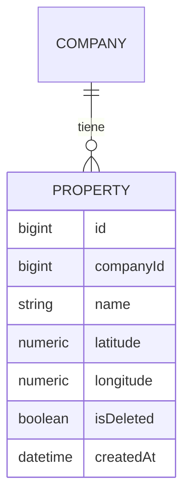

# Property (Propiedad / finca ganadera)

**Estado de implementación:** ✅ CRUD completo (backend + frontend), 2026-09-04. Primer concepto
del negocio ganadero en sí — todo lo anterior (`company`, `user`, `role`, `permission`, ...) es
administración/plataforma.

## Propósito

Una finca ganadera. Pertenece a una empresa, tiene ubicación (latitud/longitud) para mostrarla
en un mapa. Es donde se envía el ganado de una `Investment` (ver `docs/investment/investment.md`).

## Modelo de dominio

## Reglas de negocio actuales

- Pertenece a **una empresa** — nombre único dentro de esa empresa (`UNIQUE(company_id, name)`,
  mismo criterio que `Role`).
- `latitude`/`longitude` son obligatorios al crear — no hay "propiedad sin ubicación" (el
  frontend arranca el selector de mapa en un punto por defecto, Santa Cruz, Bolivia, hasta que
  el usuario haga clic para marcar el real).
- Sin campo de dirección de texto — la ubicación es solo el par de coordenadas, suficiente para
  un marcador de mapa.
- Puede desactivarse (`isDeleted = true`) sin eliminarse, igual que el resto del proyecto.

## Casos de uso (Application)

| Caso de uso | Qué hace | Errores que puede lanzar |
|---|---|---|
| `CreatePropertyUseCase` | Crea una propiedad en la empresa activa | `PropertyAlreadyExistsException` |
| `UpdatePropertyUseCase` | Renombra/reubica una propiedad existente — valida que sea de la empresa activa | `PropertyNotFoundException`, `PropertyAlreadyExistsException` |
| `DeactivatePropertyUseCase` | Desactiva una propiedad — misma validación | `PropertyNotFoundException` |
| `ListPropertiesByCompanyUseCase` | Lista las propiedades activas de la empresa activa | — |

## HTTP

Sin `companyId` en la URL ni el body — siempre `@CurrentUser('companyId')` (la empresa activa
de la sesión), mismo criterio que `Role`/`User`.

| Método y ruta | Caso de uso |
|---|---|
| `POST /properties` | `CreatePropertyUseCase` |
| `PATCH /properties/:id` | `UpdatePropertyUseCase` |
| `PATCH /properties/:id/deactivate` | `DeactivatePropertyUseCase` (204) |
| `GET /properties?page=&pageSize=&search=` | `ListPropertiesByCompanyUseCase` — paginado en el servidor |

## Pantalla (frontend)

`app/(main)/properties` — mismo patrón que "Empresas" (confirmación genérica de eliminar), con
un campo extra (selector de ubicación, `LocationMapPicker`, Leaflet + OpenStreetMap, sin API key
ni costo — clic en el mapa mueve el marcador; "Ver en Google Maps" en la tabla y en el diálogo
es solo un link con esas coordenadas, `https://www.google.com/maps?q=lat,lng`, no un embed de
Google) y una diferencia real: **paginación de servidor**, no de cliente
(`useProperties(page, pageSize, search)`, buscador con debounce de 300ms — mismo patrón que
`Users`, ver `frontend/ARCHITECTURE.md` §8/§9). Los combobox de Propiedad en Inversiones/Kardex
no usan ese hook — usan `usePropertyOptions()` (hasta 100 registros de una, sin paginar), porque
un `<select>` no puede "pasar de página".

## Últimos cambios

Ver el historial completo en [`changes/`](./changes/).

- [2026-09-05 — Paginación de servidor](../investment/changes/2026-09-05-paginacion-de-servidor.md)
- [2026-09-04 — Mapa de ubicación más grande](./changes/2026-09-04-mapa-mas-grande.md)
- [2026-09-04 — Grupo "Inversiones" en el sidebar](../menu/changes/2026-09-04-grupo-inversiones-y-kardex.md)
- [2026-09-04 — Diseño e implementación inicial](./changes/2026-09-04-diseno-inicial.md)
