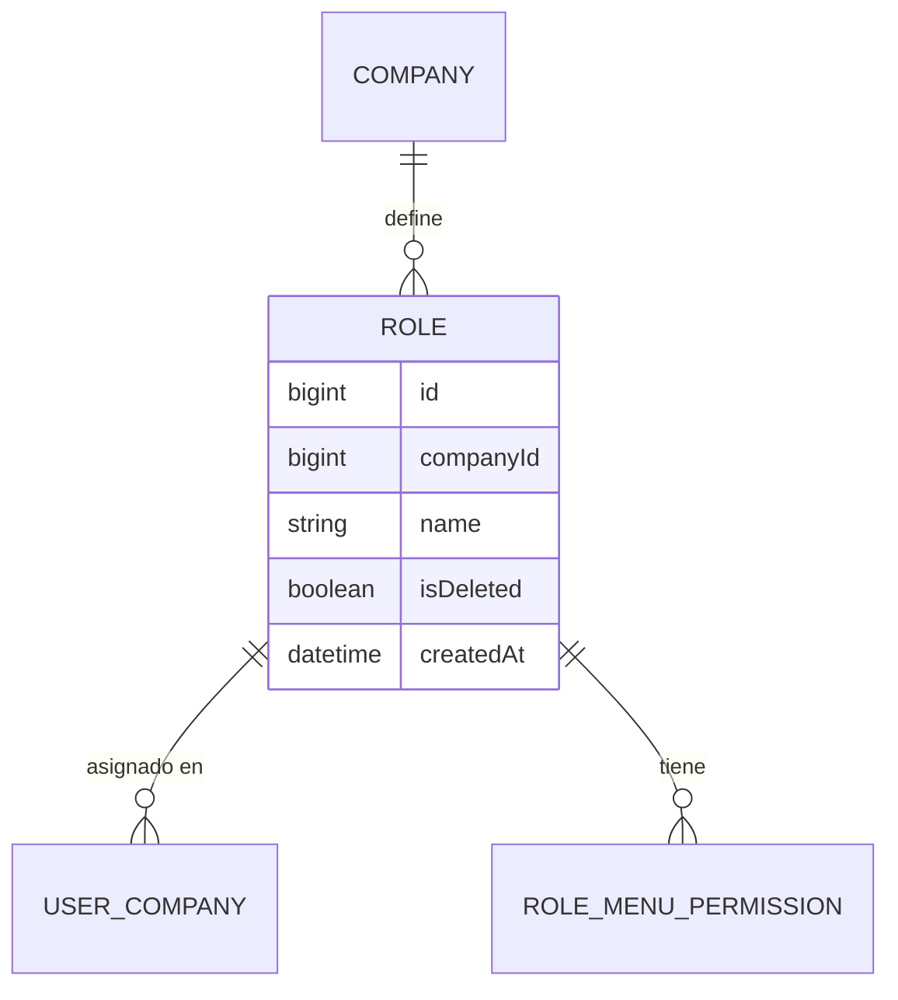

# Role (Rol)

**Estado de implementación:** ✅ Fase 1, Fase 2 (seed: rol "Administrador"), Fase 3 (dominio +
persistencia), Fase 6 (casos de uso) y `RoleController` (HTTP) completas — protegido por el
guard (Fase 9), sin autorización por permiso todavía (ver `docs/permission/permission.md`).

## Propósito

Un rol pertenece a **una empresa concreta** y agrupa los permisos que sus usuarios tendrán
sobre los distintos menús del sistema (vía `RoleMenuPermission`).

## Modelo de dominio

## Reglas de negocio actuales

- **Cada empresa crea y administra sus propios roles** — no existen roles globales fijos
  (no hay un enum cerrado tipo `ADMIN`/`INVESTOR`; dos empresas distintas pueden llamar a sus
  roles como quieran, incluso con el mismo nombre, sin conflicto entre sí).
- El nombre de un rol es único **dentro de su empresa** (`UNIQUE(company_id, name)`).
- No hay auto-creación de un rol por defecto al crear una empresa: los roles se crean
  manualmente vía el CRUD de roles (pantalla dedicada).
- Un rol puede desactivarse (`isDeleted = true`) sin eliminarse.
- La integridad "este rol pertenece a esta empresa" está garantizada a nivel de base de datos:
  `roles` tiene `UNIQUE(id, company_id)`, y `user_companies` usa una FK compuesta
  `(company_id, role_id) → roles(company_id, id)` — no es posible asignar a un usuario un rol
  de otra empresa.
- El nombre de un rol **no puede estar vacío** (ni ser solo espacios) — validado en la propia
  entidad `Role` (`create`/`rename`), lanza `InvalidRoleNameException`.

## Casos de uso (Application)

| Caso de uso | Qué hace | Errores que puede lanzar |
|---|---|---|
| `CreateRoleUseCase` | Crea un rol en una empresa | `CompanyNotFoundException`, `RoleAlreadyExistsException`, `InvalidRoleNameException` |
| `UpdateRoleUseCase` | Renombra un rol existente — valida que sea de la empresa activa | `RoleNotFoundException`, `RoleAlreadyExistsException`, `InvalidRoleNameException` |
| `DeactivateRoleUseCase` | Desactiva un rol (`isDeleted = true`) — misma validación | `RoleNotFoundException` |
| `ListRolesByCompanyUseCase` | Lista los roles activos de una empresa | `CompanyNotFoundException` |

## HTTP

| Método y ruta | Caso de uso |
|---|---|
| `POST /roles` | `CreateRoleUseCase` — `companyId` sale de `@CurrentUser('companyId')` (la empresa activa de la sesión), nunca de la URL |
| `PATCH /roles/:id` | `UpdateRoleUseCase` — 404 si el rol no es de la empresa activa |
| `PATCH /roles/:id/deactivate` | `DeactivateRoleUseCase` (204) — misma validación |
| `GET /roles` | `ListRolesByCompanyUseCase` — misma empresa activa |

`POST`/`GET` antes eran `POST/GET /companies/:companyId/roles` — cualquiera podía crear o
listar roles de cualquier empresa cambiando el parámetro de la URL. `PATCH` nunca había tenido
ningún chequeo de empresa, ni antes ni con esa primera corrección. Los cuatro quedaron
corregidos al mismo tiempo (2026-09-04, ver `docs/permission/permission.md`), junto con el
mismo hueco en `UserController` (ver `docs/user/user.md` y `docs/auth-sessions/auth-sessions.md`).

## Pantalla (frontend)

`app/(main)/roles` — mismo patrón que "Empresas" (paginación de cliente, un solo campo
`name`, confirmación genérica de eliminar): la empresa nunca se elige a mano, siempre es la
empresa activa de la sesión (ver `CompanySwitcher` en `ARCHITECTURE.md` del frontend).

## Últimos cambios

Ver el historial completo en [`changes/`](./changes/).

- [2026-09-04 — Roles sin `companyId` en la URL](./changes/2026-09-04-roles-sin-companyid-en-url.md)
- [2026-09-02 — Controladores CRUD + CORS](../company/changes/2026-09-02-controladores-crud.md)
- [2026-08-31 — Fase 6: casos de uso CRUD de roles](./changes/2026-08-31-fase-6-casos-de-uso-role.md)
- [2026-08-23 — Fase 3: dominio y persistencia](./changes/2026-08-23-fase-3-dominio-persistencia.md)
- [2026-08-23 — Fase 2: seed inicial aplicado](./changes/2026-08-23-fase-2-seed.md)
- [2026-08-23 — Corrección: ids de UUID a bigint](./changes/2026-08-23-cambio-ids-a-bigint.md)
- [2026-08-23 — Fase 1: migración inicial aplicada](./changes/2026-08-23-fase-1-migracion-inicial.md)
- [2026-08-23 — Diseño inicial](./changes/2026-08-23-diseno-inicial.md)
