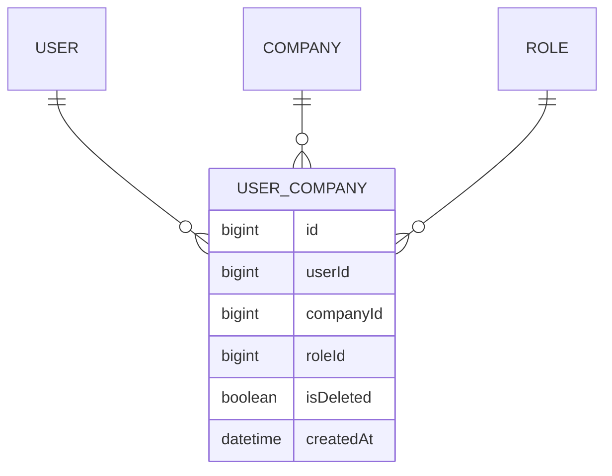

# UserCompany (vínculo usuario ↔ empresa ↔ rol)

**Estado de implementación:** ✅ Fase 1, Fase 2 (seed: vínculo del admin), Fase 3 (dominio +
persistencia) y Fase 5 completas: se crea junto con el `User` (`RegisterUserUseCase`, ver
`user.md`), y además `AssignUserToCompanyUseCase`, `ChangeUserCompanyRoleUseCase`,
`DeactivateUserCompanyUseCase`, `ListUserCompaniesByUserUseCase` con `UserCompanyController`
(HTTP) — protegido por el guard (Fase 9), sin autorización por permiso todavía.

## Propósito

Vínculo entre un `User` y una `Company`, con el `Role` que ese usuario tiene dentro de esa
empresa. Es la pieza que hace posible el **multiempresa real**: un mismo usuario puede ser
"Administrador" en la Empresa A e "Inversionista" en la Empresa B.

## Modelo de dominio

## Reglas de negocio actuales

- Un usuario tiene **como máximo un vínculo activo por empresa** (`UNIQUE(user_id, company_id)`).
- El rol asignado debe pertenecer a la **misma empresa** del vínculo — garantizado a nivel de
  base de datos con una FK compuesta `(company_id, role_id) → roles(company_id, id)`, no solo
  a nivel de código.
- Al hacer login, si el usuario tiene más de un `UserCompany` activo, debe indicar con qué
  empresa quiere iniciar sesión (ver `auth-sessions`).
- Se crea junto con el `User` en la misma transacción cuando un admin da de alta a alguien
  nuevo en su empresa (ver ARCHITECTURE.md §7 — regla de transaccionalidad).
- La `UNIQUE(user_id, company_id)` es incondicional (no depende de `isDeleted`): si un vínculo
  ya existe —activo o desactivado— no se puede crear uno nuevo para ese mismo par. Reactivar
  un vínculo desactivado queda **pendiente**: `UserCompany` todavía no tiene un método para
  eso (solo `deactivate()`); hoy `AssignUserToCompanyUseCase` lanza
  `UserCompanyAlreadyExistsException` en ambos casos.

## Casos de uso (Application)

| Caso de uso | Qué hace | Errores que puede lanzar |
|---|---|---|
| `AssignUserToCompanyUseCase` | Da acceso a un usuario **existente** a otra empresa con un rol | `UserNotFoundException`, `CompanyNotFoundException`, `RoleNotFoundException`, `UserCompanyAlreadyExistsException` |
| `ChangeUserCompanyRoleUseCase` | Cambia el rol de un vínculo ya existente — valida que el vínculo sea de la empresa activa de quien pide el cambio | `UserCompanyNotFoundException`, `RoleNotFoundException` |
| `DeactivateUserCompanyUseCase` | Desactiva un vínculo | `UserCompanyNotFoundException` |
| `ListUserCompaniesByUserUseCase` | Lista las empresas activas de un usuario | `UserNotFoundException` |
| `GetUserRoleInCompanyUseCase` | Da el vínculo de un usuario en la empresa activa de quien pregunta (para saber qué rol tiene hoy antes de dejarlo cambiar) | `NoActiveUserCompanyException` |

`ChangeUserCompanyRoleUseCase` recibe `companyId` de `@CurrentUser('companyId')` — antes no
validaba nada, cualquiera con sesión podía reasignar el rol de un usuario de **otra** empresa
adivinando el id numérico del vínculo. Mismo hueco y misma corrección que el resto de `Role`
(ver `docs/role/role.md` y `docs/permission/permission.md`).

## HTTP

| Método y ruta | Caso de uso |
|---|---|
| `POST /users/:userId/companies` | `AssignUserToCompanyUseCase` |
| `PATCH /user-companies/:id/role` | `ChangeUserCompanyRoleUseCase` — 404 si el vínculo no es de la empresa activa |
| `PATCH /user-companies/:id/deactivate` | `DeactivateUserCompanyUseCase` (204) |
| `GET /users/:userId/companies` | `ListUserCompaniesByUserUseCase` |
| `GET /users/:userId/role` | `GetUserRoleInCompanyUseCase` (nuevo) — el vínculo en la empresa activa, para la pantalla de Usuarios |

## Pantalla (frontend)

El diálogo de edición de `app/(main)/users` (ver `docs/user/user.md`) ahora también permite
cambiar `Tipo de usuario` y `Rol` — antes esos dos endpoints (`PATCH /users/:id/user-type` y
`PATCH /user-companies/:id/role`) existían en el backend pero no estaban conectados a ninguna
pantalla. `GET /users/:userId/role` es nuevo específicamente para esto: sin él no había forma
de saber, antes de abrir el diálogo, qué `userCompanyId`/`roleId` tenía hoy el usuario en la
empresa activa.

## Últimos cambios

Ver el historial completo en [`changes/`](./changes/).

- [2026-09-04 — Cambiar tipo/rol desde la pantalla de Usuarios + scoping por empresa](./changes/2026-09-04-cambiar-tipo-y-rol-desde-usuarios.md)
- [2026-09-02 — Controladores CRUD + CORS](../company/changes/2026-09-02-controladores-crud.md)
- [2026-08-31 — Casos de uso de gestión del vínculo](./changes/2026-08-31-casos-de-uso-user-company.md)
- [2026-08-23 — Fase 3: dominio y persistencia](./changes/2026-08-23-fase-3-dominio-persistencia.md)
- [2026-08-23 — Fase 2: seed inicial aplicado](./changes/2026-08-23-fase-2-seed.md)
- [2026-08-23 — Corrección: ids de UUID a bigint](./changes/2026-08-23-cambio-ids-a-bigint.md)
- [2026-08-23 — Fase 1: migración inicial aplicada](./changes/2026-08-23-fase-1-migracion-inicial.md)
- [2026-08-23 — Diseño inicial](./changes/2026-08-23-diseno-inicial.md)
