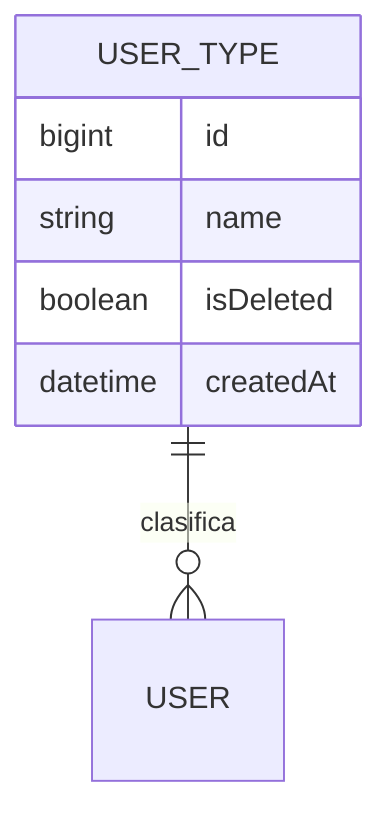

# UserType (tipo de usuario)

**Estado de implementación:** ✅ Migración, seed, Fase 3 (dominio + persistencia),
`ListUserTypesUseCase` y `GET /user-types` (protegido por el guard) completas. No tiene CRUD
planeado por ahora.

## Propósito

Clasificación de un usuario: Super Administrador, Administrador o Inversionista. Sigue sin
tener relación con los permisos por menú — eso sigue siendo responsabilidad exclusiva de
`Role` + `RoleMenuPermission` (ver `role.md` y `permission.md`) — pero **ya no es puramente
informativo**: define un único eje de comportamiento, la **visibilidad de empresas**
(ver "Reglas de negocio actuales").

## Modelo de dominio

## Reglas de negocio actuales

- Todo usuario tiene **exactamente un** `UserType` (`users.user_type_id`, `NOT NULL`).
- Es un catálogo fijo y global: "Super Administrador", "Administrador" e "Inversionista",
  sembrado por migración (`AddUserType`, `AddSuperAdminUserType`). No hay endpoint para
  crear/renombrar tipos, solo `GET /user-types` para listarlos.
- **Visibilidad de empresas** (`UserType.isSuperAdmin()`, comparado contra el nombre exacto
  "Super Administrador" — ver la constante `SUPER_ADMIN_USER_TYPE_NAME`):
  - **Super Administrador**: ve **todas** las empresas (`GET /companies` devuelve el catálogo
    completo). Es el único tipo pensado para tener más de una `UserCompany` activa.
  - **Administrador** / **Inversionista**: ven **solo** la empresa de su sesión actual (la
    del token con el que iniciaron sesión) — `GET /companies` devuelve un array de 1 elemento.
  - Este dato se calcula **una sola vez, al emitir el access token** (`LoginUseCase`,
    `RefreshTokenUseCase`) y viaja como `isSuperAdmin: boolean` en el payload del JWT — igual
    que `companyId`/`roleId`. Si el tipo de un usuario cambia, el efecto se ve recién en su
    próximo login (no hay invalidación activa de tokens vigentes).
- **No otorga ni restringe permisos por menú** — eso lo hace `Role` (dinámico, por empresa).
  Un usuario de tipo "Inversionista" podría en teoría tener un `Role` con permisos amplios en
  su empresa, y viceversa; son ejes independientes.
- **Quién puede ser inversionista de una `Investment`** (`UserType.isInvestor()`, comparado
  contra el nombre exacto "Inversionista" — ver la constante `INVESTOR_USER_TYPE_NAME`): solo
  un usuario de este tipo puede aparecer en la lista de inversionistas de una inversión
  (`InvalidInvestorException` si no) — ver `docs/investment/investment.md`.
- **Qué dashboard ve** (`UserType.isInvestor()`, mismo cálculo de arriba): igual que
  `isSuperAdmin`, se calcula una sola vez al emitir el access token y viaja como
  `isInvestor: boolean` en el payload — el frontend lo usa para elegir entre el dashboard de
  Inversionista (sus propias inversiones) o el de Administrador/Super Administrador (agregados
  de la empresa activa). Ver `docs/dashboard/dashboard.md`.

## Casos de uso (Application)

| Caso de uso | Qué hace | Errores que puede lanzar |
|---|---|---|
| `ListUserTypesUseCase` | Lista el catálogo completo | — |

## HTTP

| Método y ruta | Caso de uso |
|---|---|
| `GET /user-types` | `ListUserTypesUseCase` |

## Últimos cambios

Ver el historial completo en [`changes/`](./changes/).

- [2026-09-02 — Super Administrador y visibilidad de empresas](./changes/2026-09-02-super-administrador-y-visibilidad-de-empresas.md)
- [2026-09-02 — Controladores CRUD + CORS](../company/changes/2026-09-02-controladores-crud.md)
- [2026-08-31 — Caso de uso de solo lectura](./changes/2026-08-31-list-user-types-use-case.md)
- [2026-08-23 — Fase 3: dominio y persistencia](./changes/2026-08-23-fase-3-dominio-persistencia.md)
- [2026-08-23 — Diseño y migración inicial](./changes/2026-08-23-diseno-y-migracion.md)
