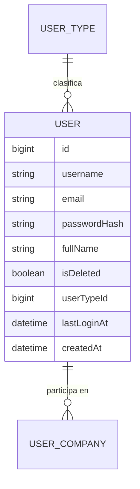

# User (Usuario)

**Estado de implementación:** ✅ Fase 1, Fase 2 (seed: usuario admin), columna `user_type_id`,
Fase 3 (dominio + persistencia), Fase 5 (casos de uso) y `UserController` (HTTP) completas —
protegido por el guard (Fase 9), sin autorización por permiso todavía (ver
`docs/permission/permission.md`).

## Propósito

Identidad de una persona en el sistema. **No sabe nada de empresas ni roles** — eso es
responsabilidad de `UserCompany`. Un `User` existe una sola vez aunque participe en varias
empresas. Sí tiene un `UserType` (ver `user-type.md`), que es solo informativo.

## Modelo de dominio

## Reglas de negocio actuales

- **`username` es el identificador de login**, único en **todo el sistema** (`UNIQUE`,
  `users.user_name`) — es lo que se usa junto con la contraseña en `POST /auth/login`, no el
  email.
- **El email puede repetirse** — no tiene restricción de unicidad (desde
  [2026-09-01](./changes/2026-09-01-username-como-login.md)). Sigue siendo un dato del usuario,
  solo que dejó de ser el identificador único.
- No hay auto-registro público. Los usuarios los crea un administrador, y esa creación
  siempre incluye asignar un rol dentro de una empresa (`User` + `UserCompany` en una sola
  transacción — ver ARCHITECTURE.md §7).
- La contraseña se almacena hasheada con bcrypt, nunca en texto plano.
- Un usuario puede desactivarse (`deactivate()`) sin eliminarse.
- Todo usuario tiene exactamente un `UserType` (obligatorio), puramente informativo — no
  otorga ni restringe permisos (ver `user-type.md`).

## Casos de uso (Application)

| Caso de uso | Qué hace | Errores que puede lanzar |
|---|---|---|
| `RegisterUserUseCase` | Crea el usuario y su primer `UserCompany`, **en una sola transacción** (§7) | `UsernameAlreadyRegisteredException`, `InvalidUsernameException`, `UserTypeNotFoundException`, `CompanyNotFoundException`, `RoleNotFoundException` (si el rol no existe o no pertenece a la empresa) |
| `UpdateUserUseCase` | Edita `email` y `fullName` (`User.updateProfile`) — a propósito no toca `username`, contraseña, ni empresa/rol | `UserNotFoundException` |
| `DeactivateUserUseCase` | Desactiva un usuario | `UserNotFoundException` |
| `ChangeUserTypeUseCase` | Cambia el `UserType` de un usuario — valida que pertenezca a la empresa activa de quien hace el cambio | `UserNotFoundException`, `UserTypeNotFoundException` |
| `ChangeOwnPasswordUseCase` | "Mi perfil": cambia la propia contraseña — exige la actual, `userId` siempre de la sesión (nunca un parámetro, a diferencia de `ChangeUserType`) | `UserNotFoundException`, `InvalidCurrentPasswordException` |
| `ListUsersUseCase` | Lista usuarios, **paginado**, no incluye dados de baja, filtra por `search` (username/email/fullName) | — |

## HTTP

| Método y ruta | Caso de uso |
|---|---|
| `POST /users` | `RegisterUserUseCase` |
| `PATCH /users/:id` | `UpdateUserUseCase` |
| `GET /users?page=&pageSize=&search=` | `ListUsersUseCase` — `page` desde 1, `pageSize` 1-100 (default 1/20), `search` opcional (ILIKE sobre username/email/fullName), ver ARCHITECTURE.md §6.1 |
| `PATCH /users/:id/deactivate` | `DeactivateUserUseCase` (204) |
| `PATCH /users/:id/user-type` | `ChangeUserTypeUseCase` (204) |
| `PATCH /users/me/password` | `ChangeOwnPasswordUseCase` (204) — `userId` sale de `@CurrentUser('sub')`, nunca de un `:id`; sin conflicto de ruta con `PATCH /users/:id` (un segmento) al ser `me/password` (dos) |

`UserResponseDto` nunca incluye `passwordHash`.

## Pantalla (frontend)

`app/(main)/users` — mismo patrón que Empresas (ver `ARCHITECTURE.md` §9 del frontend), con
diferencias a propósito:
- **Paginación real de servidor** (no client-side): la tabla de usuarios puede crecer mucho más
  que la de empresas, así que la búsqueda y la paginación viajan como `page/pageSize/search` en
  la query string, no se descarga todo de una.
- El diálogo de alta pide `userTypeId` y `roleId` (selects) — nunca `companyId`, siempre es la
  empresa activa de la sesión (ver `docs/auth-sessions/auth-sessions.md`).
- El diálogo de edición permite tocar `email`, `fullName`, `userTypeId` y `roleId` — los
  últimos dos vía `PATCH /users/:id/user-type` y `PATCH /user-companies/:id/role`
  respectivamente (ver `docs/user-company/user-company.md`), acciones separadas del `PATCH
  /users/:id` genérico. `username` sigue sin poder editarse desde ningún lado — ni un
  administrador editando a otro usuario acá, ni el propio usuario en "Mi perfil" (ver abajo):
  es el identificador de login, cambiarlo es una feature que no existe todavía.
- **`app/(main)/profile`** ("Mi perfil", disparado desde el menú del `TopBar`) — sin
  `RequirePermission` (mismo criterio que `/dashboard`): no es un módulo de negocio con permiso
  por rol, es una acción sobre uno mismo, disponible para cualquier usuario logueado. Dos
  tarjetas independientes, cada una con su propio `useMutation`: "Datos personales" (edita
  `email`/`fullName` reusando el mismo `PATCH /users/:id` de arriba, con el propio id del
  usuario) y "Cambiar contraseña" (`PATCH /users/me/password`, exige la contraseña actual). El
  `username` (identificador de login) se ve pero no se puede tocar acá tampoco. `username`/
  `fullName`/`email` arrancan del token decodificado (mismo criterio que `TopBar`) — tras
  guardar "Datos personales" con éxito, se actualizan con la respuesta real del backend, no con
  el token (que queda desactualizado hasta el próximo login/refresh, ver `frontend/
  ARCHITECTURE.md` §8).

## Últimos cambios

Ver el historial completo en [`changes/`](./changes/).

- [2026-09-06 — "Mi perfil": editar datos personales y cambiar contraseña](./changes/2026-09-06-mi-perfil.md)
- [2026-09-03 — Editar usuario, búsqueda de servidor y filtro de dados de baja](./changes/2026-09-03-editar-usuario-y-busqueda.md)
- [2026-09-02 — Listado de usuarios paginado](./changes/2026-09-02-listar-usuarios-paginado.md)
- [2026-09-02 — Controladores CRUD + CORS](../company/changes/2026-09-02-controladores-crud.md)
- [2026-09-01 — `username` reemplaza a email como identificador de login](./changes/2026-09-01-username-como-login.md)
- [2026-08-31 — Fase 5: casos de uso de registro de usuarios](./changes/2026-08-31-fase-5-casos-de-uso-user.md)
- [2026-08-23 — Fase 3: dominio y persistencia](./changes/2026-08-23-fase-3-dominio-persistencia.md)
- [2026-08-23 — Se agrega UserType](../user-type/changes/2026-08-23-diseno-y-migracion.md)
- [2026-08-23 — Fase 2: seed inicial aplicado](./changes/2026-08-23-fase-2-seed.md)
- [2026-08-23 — Corrección: ids de UUID a bigint](./changes/2026-08-23-cambio-ids-a-bigint.md)
- [2026-08-23 — Fase 1: migración inicial aplicada](./changes/2026-08-23-fase-1-migracion-inicial.md)
- [2026-08-23 — Diseño inicial](./changes/2026-08-23-diseno-inicial.md)
